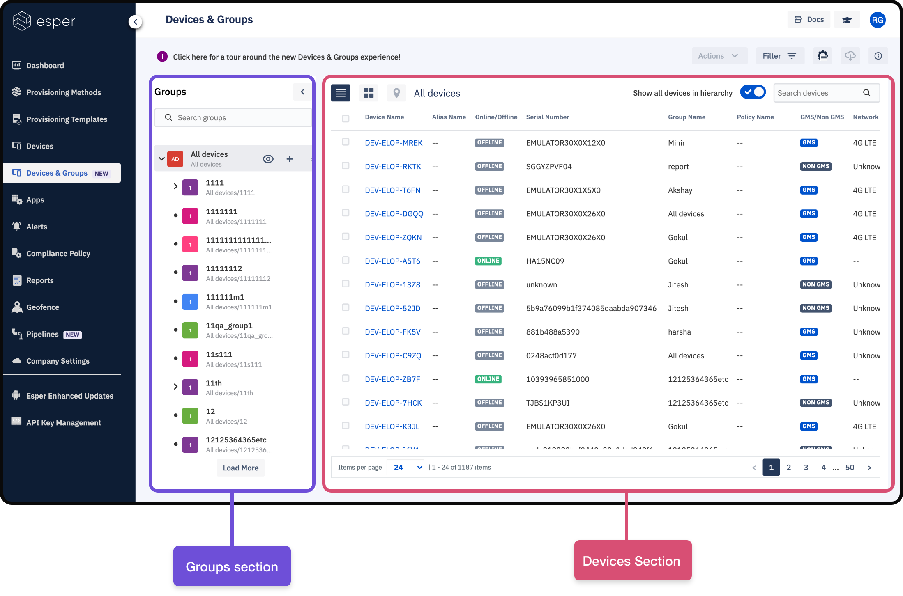
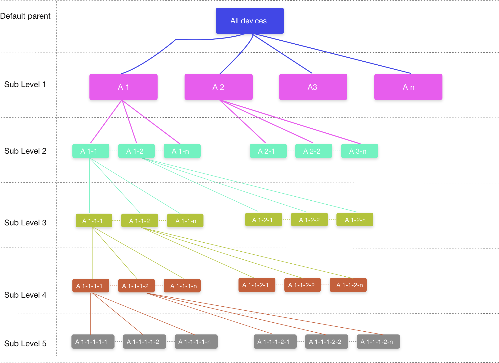

# Add new devices to sub group

Once you’ve added actual or simulated devices to the Console, the Devices  and Groups view will list all the devices and groups structure 
Into this screen. On left side of pane you can see all you device groups in nested structure. And right side of screen section you can see
All the devices associated with selected group on the left hand side of screen. Check ima

:::tip
This is a tip
:::

## Nested groups introduction

Nested groups can be created at any level. For now you can create maximum of 5 sub levels to any parent device group. But you can 
Create as many as  parents  you want. Also by  default their is always one super parent group named  “ All devices ”. That will act as 
Master parent to all the groups by default . All devices groups cannot be deleted .

## Add New device subgroup

Device sub groups can be added at any level on the basis of how you have structured your nested groups.

### Step 1:  Identify the nested group level where you wish to add sub group

### Step 2:  Hover over the identified group to see  +  icon and tap on it 

::: tip
You cannot add more than 5 level of sub groups . Before adding a new sub group check at what level of nested 
structure  you are at. If you are already at 5 , then + icon will be disabled
:::

## Delete groups

You are allowed to delete any group except “All devices” group which is a system group. Also when you delete a device group 
It will not delete the devices or sub groups inside the group . But actually it just delete that group and all the subgroups and
Devices will be moved under immediate parent of deleted group. If in case you haven’t created any parent for that group. Then
It will move under system parent group “All devices”. 

Below are the steps to delete a group: