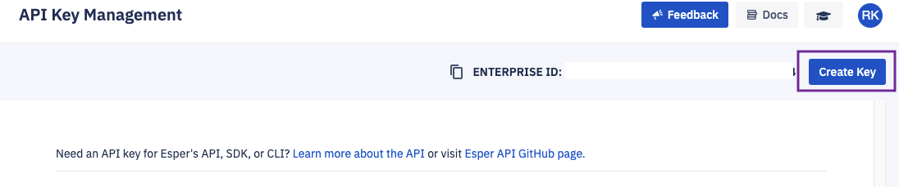

## How to Generate an API Key From the Console?

  

The first step in interacting with our API is to generate an API key. To do this, click **Create Key** button.

You can copy the Enterprise ID, necessary for API calls, by clicking on the copy icon next to Enterprise ID on the top right of this section.

:::tip
It's always best to have a key dedicated to a single purpose.
Naming the API key helps you ensure this principle sticks.
::: 
  

Enter a unique API name and description (optional) and click **Create Key**.

  
  

  

Click **Generate Token**. This will generate a unique OAuth-based API key.

  

  

You can then copy (or renew if needed) your API key. 

:::tip
API key is not renewed automatically.
:::

API keys created after end of July 2020 needs to be renewed every 1000 days after creation. But the API keys created before end of July 2020 will expire at the start of February 2023.  

  

  
  

You will need your API key and Enterprise ID to access our  [CLI platform](https://github.com/esper-io/esper-cli) as well as to use the SDK/API in your development and management systems. Please visit Esper documentation [Esper docs](https://docs.esper.io/) for more information.

An API key is tied to the user account used to create the key. If you delete a user via User management, then any API keys associated with that user will also be deleted. The API key will be rendered invalid for API, SDK, and CLI use. To avoid such unintended deletion of API key, a best practice is to create a specific user account just for API key management. 

:::tip
The Enterprise ID is specific to your endpoint and does not change.
:::