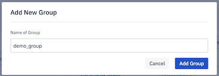
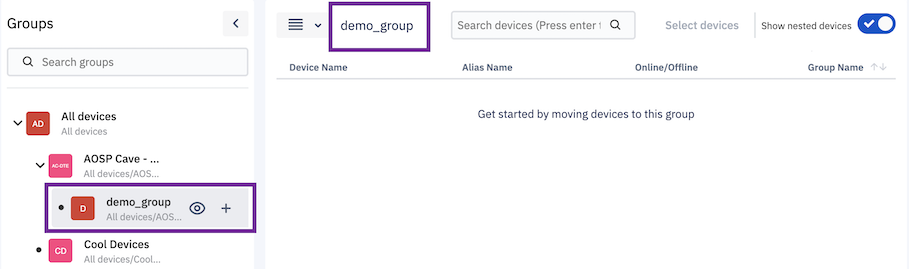

## How to Create a New Device Group?

  

You can add device subgroups at any level based on the structure of your nested groups.

  

Step 1: Identify the parent group to which you wish to create a new subgroup.

  

  
  
  

Step 2: Hover over the identified group to see the + icon and click on it.

  
  

  

Step 3: Enter the name of the group and click on the **Add Group** button.

  

  

A toast message at the bottom will indicate success or failure to create a group. If the new group is created successfully, it will be displayed under the specified parent group.

  

  

:::tip
Up to five levels of nested groups are allowed beyond which '+' icon will be disabled.
:::