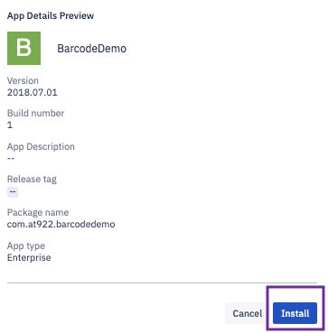
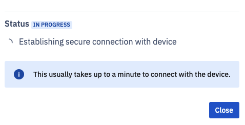
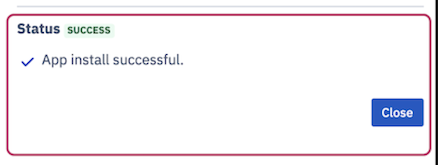

## How to Install and UnInstall an Application on Device From the Console?

  
### Install Application

Esper allows users to install both private and Google applications via a unified experience.

  

Step 1: The **New App Install** button lets you install new applications on the device.

  

  

Step 2: You will see a slide-out from the right when you click on the **New App Install** button. Here, you will be able to select the application from the list of all approved Google applications and all uploaded Enterprise applications.

  

  

Step 3: If you have multiple application versions you can select the version you wish to install from the list.

  

If you choose the manage config checkbox, you will be prompted to enter a valid JSON code. This feature gives administrators flexibility to remotely configure work applications. 

**Notes**:

  

1.  Manage configurations can be applied to Android devices 5.0 or above.
    
2.  All the applications will accept these JSON values. You will be able to see the changes only on the applictaions where the JSON values are applicable.

3.  Manage configurations cannot be applied to a Google play store application while installing it. However, an installed application can have managed configurations.
  
Following is a sample code for Chrome (Version 86 and above) Manage Configuration:

    {"URLBlocklist":[
    "example.com",
    "https://ssl.server.com",
    "hosting.com/bad_path",
    "https://server:8080/path",
    ".exact.hostname.com",
    "file://*",
    "custom_scheme:*",
    "*"],
    "SafeBrowsingProtectionLevel":1,

    "HomepageLocation":"https://www.chromium.org", "CookiesBlockedForUrls":[
    "https://www.example.com",
    "[*.]example.edu"
    ],
      "DefaultGeolocationSetting":3     
    }

Following is a sample code for Chrome (Version below 86) Manage Configuration:

    {"URLBlacklist":[
    "example.com",
    "https://ssl.server.com",
    "hosting.com/bad_path",
    "https://server:8080/path",
    ".exact.hostname.com",
    "file://*",
    "custom_scheme:*",
    "*"],
    "SafeBrowsingProtectionLevel":1,

    "HomepageLocation":"https://www.chromium.org", "CookiesBlockedForUrls":[
    "https://www.example.com",
    "[*.]example.edu"
    ],
      "DefaultGeolocationSetting":3     
    }

Step 4: Preview the applictaion details and then click **Install** button, when ready.

  

  

Step 5: You can see the “In progress” status in the status section when the installation is in progress.

  

The app installation screen also includes an estimated total time required for the installation. If an error occurs, the Console will display an error message. 

Step 6: Upon successful installation, you will see the application installation success message in the status section.

  

  

Once you close the slideout, you can see the application you installed in your application list.

### Uninstall Application
You can uninstall the application on your device from the application section. Following are the steps to uninstall an application:

  

Step 1: In the applications section, click the ellipsis and choose the ‘Uninstall’ option.

  

  

Step 2: On the slide-out from the right side, click the **Uninstall** button.

  

Step 3: A command will be sent to the device to uninstall the application and you will get a success message on completion.

  
  

:::tip
You cannot uninstall an application if a device is offline.
:::

  
