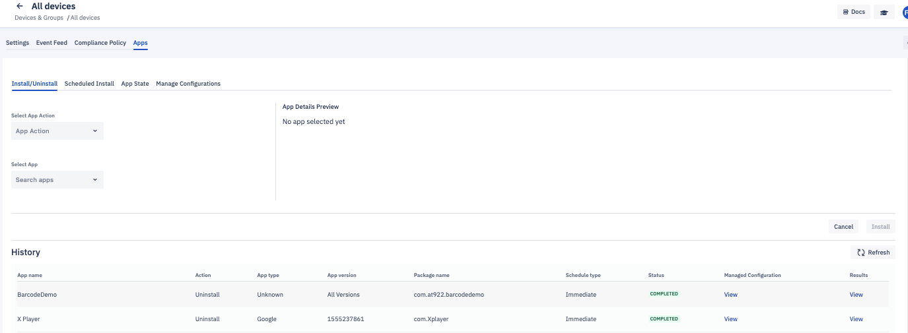
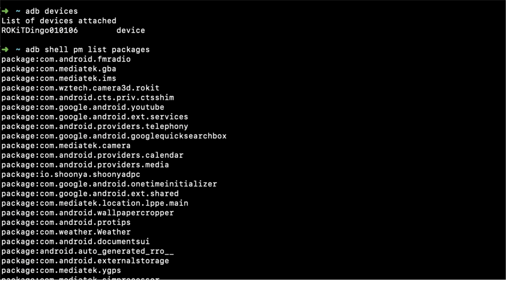

##  How to Manage Applications for a Group?

  

Inside the 'Apps' tab, you can perform various actions -installing new applications, uninstalling applications, scheduling an application installation, and approving applications - on the applications within the group. 

  




###  Set Application State on the Device Group From the Console

  
The Application State section enables you to show, hide or disable in-ROM applications (also referred to as Preloaded applications) on all the devices in the group.

  


  

To change the application state status, enter its package name in the box and click **Show**, **Hide**, or **Disable**.

  


  

Click **Apply**. The Console will display the group command status.

  


  

Click "See Details" to view the status of the installation on the slide-out from right.


:::tip
You need to enter the exact package name of any in-ROM applications you wish to show, hide, or delete. For example, Chrome’s package name is “com.android.chrome;”.
:::

 
###  Finding Package Names

The best way to get the exact package name of an in-ROM application is to use an Android Debug Bridge (ADB) command to retrieve the names of all the packages.

Physically connect to the device using a USB cable and authorize ADB usage on the device by going to **Device** > **Settings**. Once ADB usage is authorized, the following command will retrieve the names of all the packages:

adb shell pm list packages

ADB will return a list of all the applications running on the device:



ALternatively, you can view the package names for any applications installed on a device by navigating to the device’s **details** > **Apps**. The package name for each application is displayed in the resulting list view.


### Manage Configurations

This section enables you to view the configurations applied to the group. When you enter a valid package name, you will be able to see the JSON code. All the applications will accept the JSON values—the changes are reflected only on the applications where the JSON values are applicable.


  
:::tip
Manage configurations are supported only on android devices 5.0 or above.
:::

Following is a sample code for Chrome (Version 86 and above) Manage Configuration:
```
{
  "URLBlocklist":[
    "example.com",
    "https://ssl.server.com",
    "hosting.com/bad_path",
    "https://server:8080/path",
    ".exact.hostname.com",
    "file://*",
    "custom_scheme:*",
    "*"
  ],
  "SafeBrowsingProtectionLevel":1,
  "HomepageLocation":"https://www.chromium.org",
  "CookiesBlockedForUrls":[
    "https://www.example.com",
    "[*.]example.edu"
  ],
  "DefaultGeolocationSetting":3
}
```

Following is a sample code for Chrome (Version below 86) Manage Configuration:


    {"URLBlacklist":[
    "example.com",
    "https://ssl.server.com",
    "hosting.com/bad_path",
    "https://server:8080/path",
    ".exact.hostname.com",
    "file://*",
    "custom_scheme:*",
    "*"],
    "SafeBrowsingProtectionLevel":1,

    "HomepageLocation":"https://www.chromium.org", "CookiesBlockedForUrls":[
    "https://www.example.com",
    "[*.]example.edu"
    ],
      "DefaultGeolocationSetting":3     
    }
