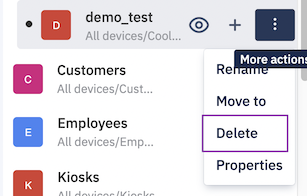

## How to Delete a Device Group?

You can delete any group except the “All devices” system group. Delete a device group will not delete the devices or subgroups inside the group, but move all the subgroups and devices under the immediate parent of the deleted group. If the deleted group does not have any parent, then the devices will move under the system parent group “All devices”.

  

Step 1: Identify the group you wish to delete from the left pane of the ‘Devices & Groups’ screen.

  
  

Step 2: On hover, click on the ellipsis icon to see more actions.

  

  
  

Step 3: Click the **Delete** option. You will get a message to confirm the delete action.

  

  

Step 4: On confirmation of the message, your group will be deleted and you will receive a success toast message.

  

