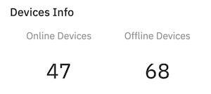
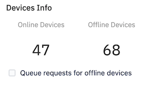
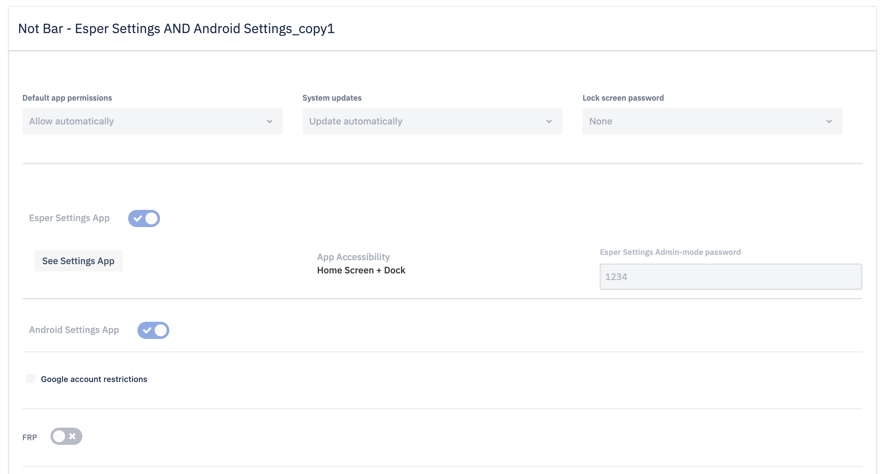
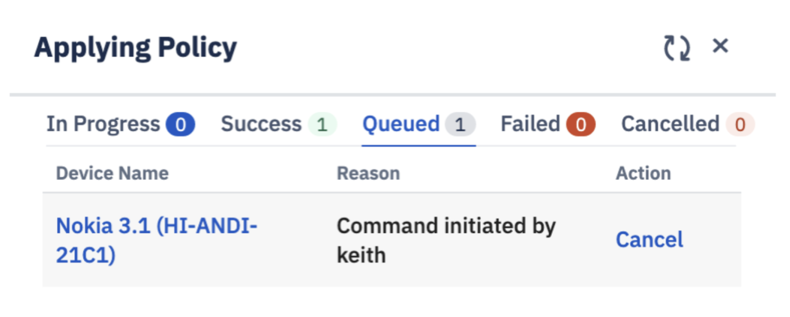

##  How to Manage the Compliance Policy on Group of Devices?

  

Compliance Policy allows you to apply an existing compliance policy to all the devices in your group. You have two choices to apply a compliance policy on a Group: apply only to online devices, or queue offline devices. The compliance policy can be applied to the queued devices only if the devices come online within 24 hours.

  

You’ll find more information on compliance policies in the  [Compliance Policy section](../compliance-policy/README.md).

###  Apply a New Compliance Policy on a Group of Devices

  

Step 1: Inside the compliance tab, you can apply a new compliance policy.

  

  

Step 2:  Select a previously created compliance policy from the Select Policy drop-down. You can search for policies using the box.

  

  

Step 3: A device info displays the number of online and offline devices.

  

  

Step 4: Select the check-box to Queue request for offile device.

  

Step 5: Preview the policy.

  

  

Step 6: Click **Apply Policy** to push the compliance policy to the group. A slide-out appears displaying the status of applying the new policy to the devices in the group.

  

  

:::tip
When you apply a compliance policy to a group, all the online devices will receive a command to comply with the policy. If you select the checkbox- “Queue requests for offline devices,” the system will queue policy updates to be pushed to all offline devices that are online within the next 24 hours.
:::