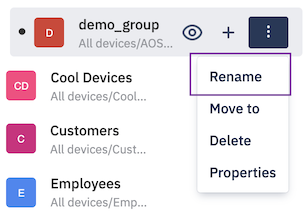
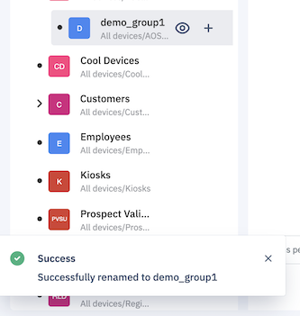

## How to Rename a Device Group?

  

You can rename any device group except the “All devices” system group.

  

Step 1: Identify the group you wish to rename.

  

  

Step 2: On hover, click the ellipsis icon to see more actions.

  

  

Step 3: Select the rename option and enter the new name in the ‘Rename Group’ popup. Once done, click on the **Rename Group** button.

  

  
  
  

Step 4: On success/failure, a toast message is displayed.

  

