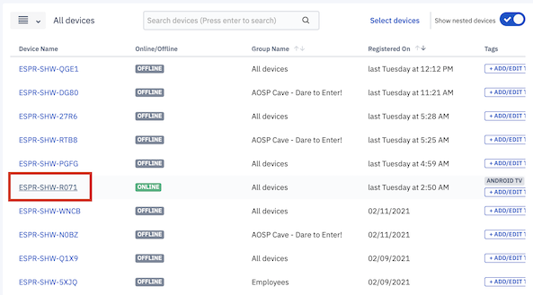
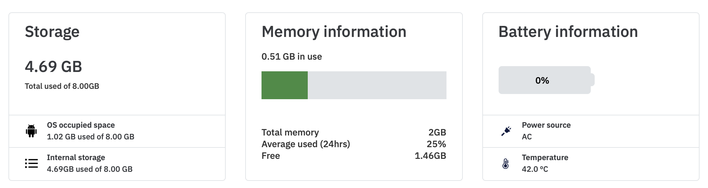
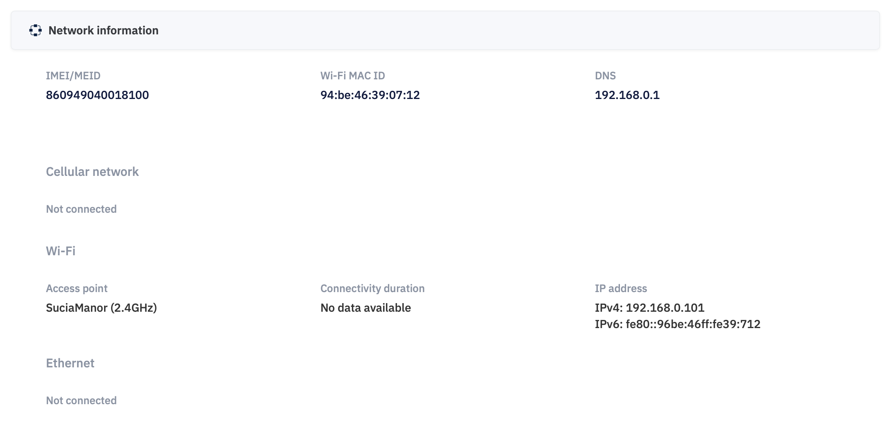

## What is the Static Device Information for a Single Device?

Static information gives you all the details about the device. You can click on a specific device name in the list view or **View Details** on a device tile in the grid view to access device information details.

  

  

You will see the below options and the first tab will show you all the static device information of the device you selected.

  

  

Under the information tab, device details are organized in the following categories to make navigation and searchability faster:

  

-   Storage, Memory, and Battery information
    

  

-   About information
    

  

-   Software information
    

  

-   Hardware information
    

  

-   Network information
    

On devices running Android 8 or above, sometimes the Wi-Fi access point is displayed as "unknown SSID" even when the device is connected to wifi. You can perform the following steps to resolve this issue:

1.  Switch "ON" the GPS.
    
2.  Refresh the web dashboard after 2-3 minutes.
    
3.  Check if the expected access point is shown.
    

If the access point is still not displayed, try the following steps:

1.  Restart the device.
    
2.  Refresh the web dashboard after 2-3 minutes.
    
3.  Check if the expected access point is shown.

-   Bluetooth and Display information
    

  

