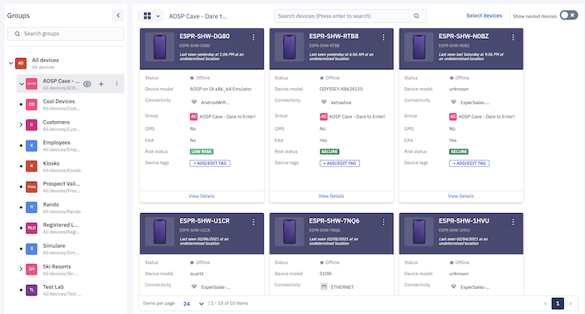
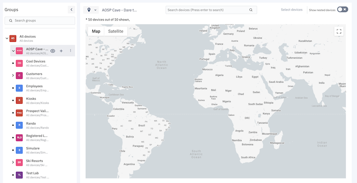

## How to Switch Between the Grid View, the List View, and the Map View?

  

In the ‘Devices & Groups’ section, we provide three different views. You can switch between these views by clicking the three lines in the device pane of the ‘Device and Group’ screen.

  

  
  

You can view the devices in the following views:

-   Grid view- This view allows you to see the devices as icons.
    

  

  
  

-   Maps view- This view allows you to see the location of the device on the map.
    

  

  

:::tip
In the map view, you can see a maximum of 500 devices. In case you have more than 500 devices, you can filter devices less than or equal to 500.
:::

-   List view- This is the default view. The devices are displayed as rows in this view.
    

  

