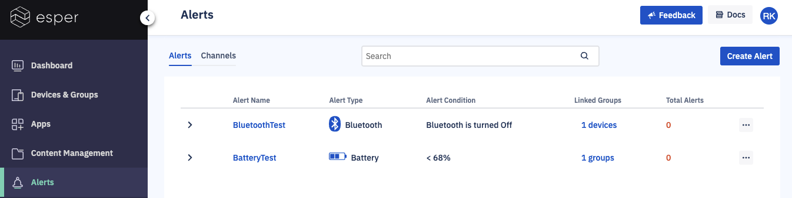
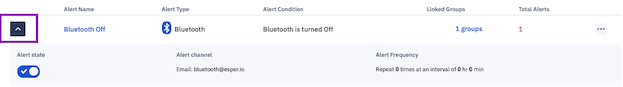
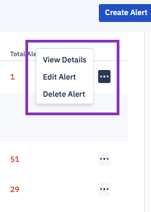
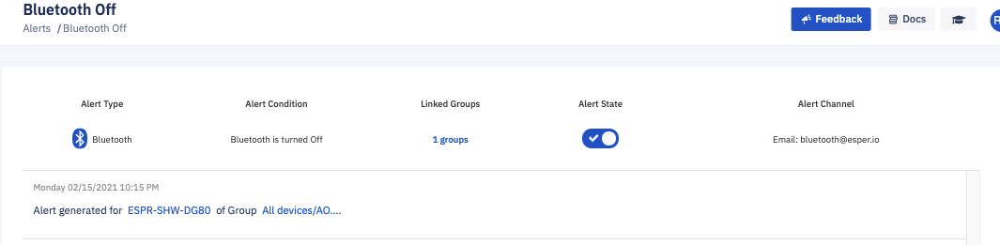
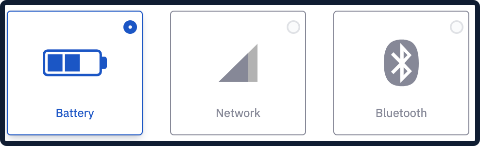

## What are Alerts?

  

Alerts enable you to monitor the performance of your devices and have the system notify you when one of your devices exceeds certain thresholds.

  

  

The Alerts section displays all the alerts you have created, indicating the name, alert type, alert condition, linked groups, and a total number of times the alert has fired.

  

Clicking on the left arrow in the table shows additional details of the alert.

  
  

The ellipses (...) at the far right of each alert listing enables you to view details about the alert, edit the alert, or delete the alert.

  

Clicking the name of an alert brings up details about that alert.

  

### Types of alerts available

  

Esper supports the following types of alerts on console:

  

-   Battery
    
-   Network
    
-   Bluetooth
    

  
  

