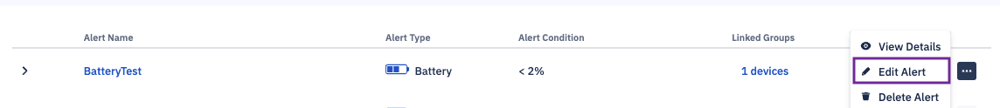

## How to Edit an Alert?

  

To edit an alert, click on the ellipsis (...) next to its listing on the ‘Alerts’ page and select ‘Edit Alert’ from the popup menu that appears.

  

  
  

Post that you can edit all the sections just like how it is created. In edit mode, you can add or remove emails or change channel type. You can also link or unlink additional devices or groups to alerts.