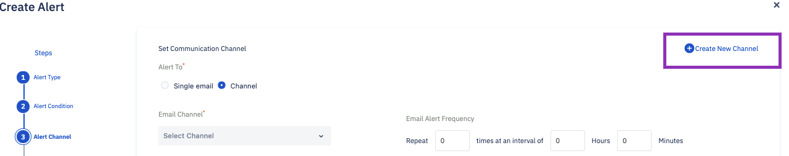
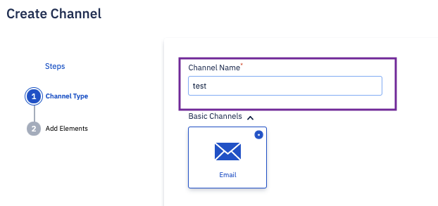
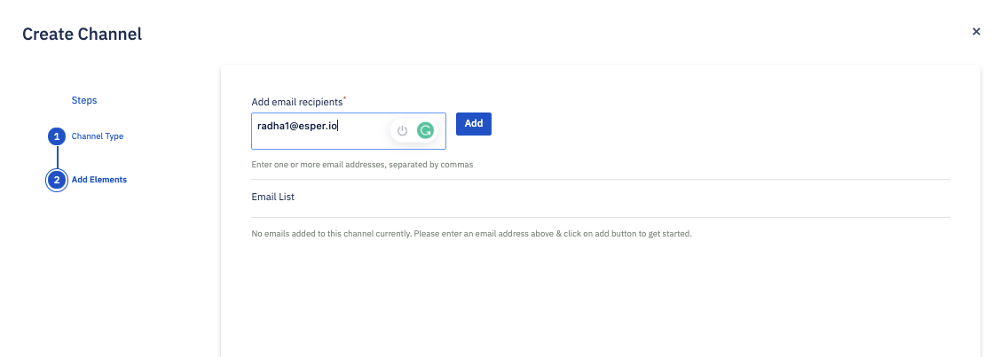
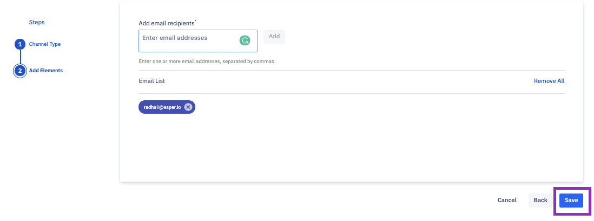

## How to Create an Email Channel?

Step 1: If you need to create a new channel, click on **New Channel** on the ‘Alert’ screen.

Step 2: Enter a name for your new channel in the Channel Name field and click **Next**.

Step 3: Add email addresses in the field provided and click **Add**.

Your email will be added to the list. You can add as many email addresses as you want. When you are done, click **Save**.

