## How to Add a New Alert?

Step 1: To create a new alert, click **New Alert**.

  

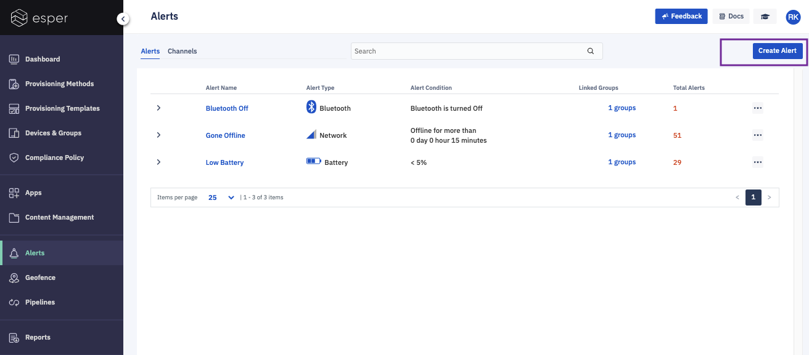

Step 2: Select an alert type and enter a name for your new alert in the Alert Name field; then click **Next**.

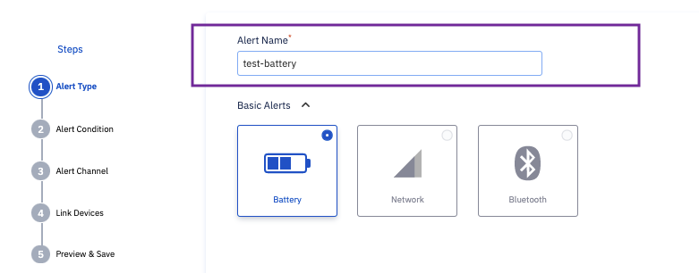

Step 3: Set the alert condition which is specific to the alert type, then click **Next**.

*Battery Alert Condition*: You can set an alert condition for the battery percent.

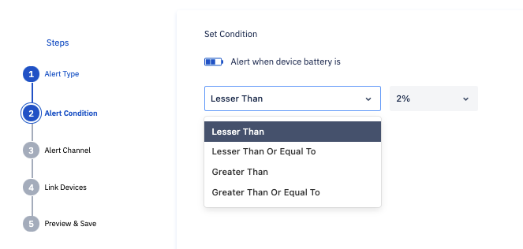

  

*Network Alert Condition*: You can set the day, hour, and minutes to alert when the devices are offline.

:::tip
Minimum value for this alert is 5 min.
:::

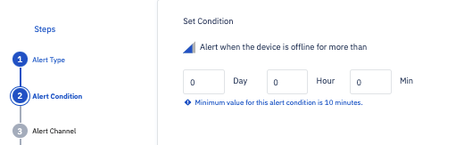

*Bluetooth Alert Condition*: You can set an alert to fire when the bluetooth is On or OFF.

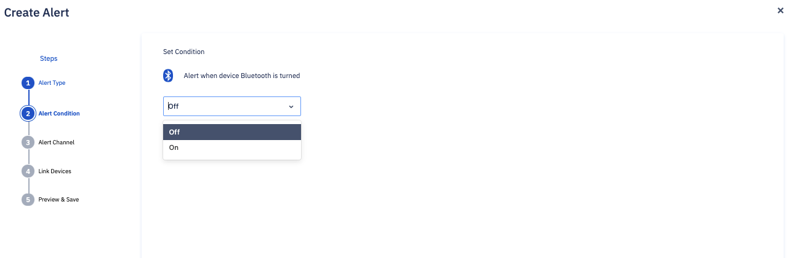

Step 4: Set the alert communication. You can have alerts sent to:

-   a single email address
    

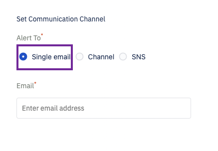

-   a channel (group of emails): Selected from a list of channels created.
    

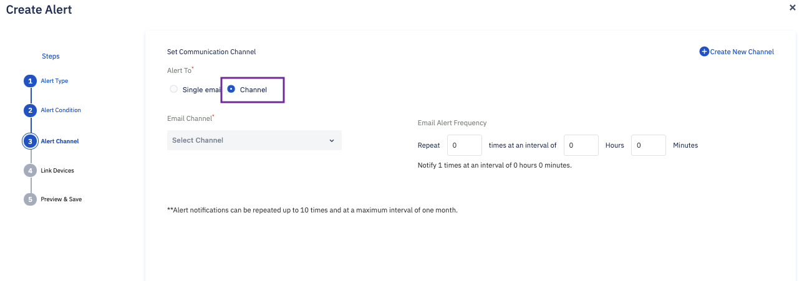

-   Create a new email channel by clicking 'Create a New Channel.' A channel helps you create a list of email addresses.  This list is used to subscribe to alerts. 

:::tip
Channels can be created once and reused across alerts. 
:::

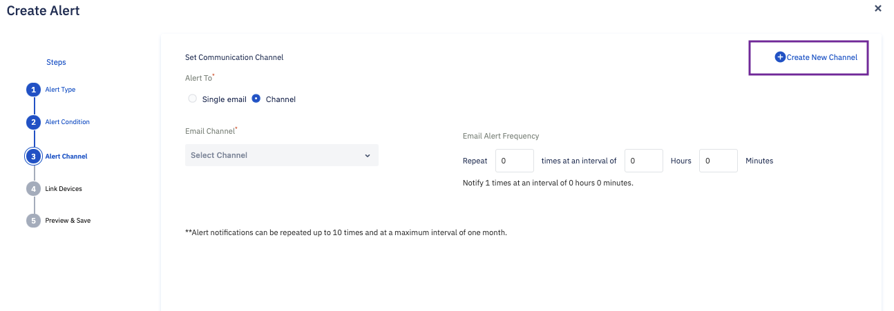

Frequency and time interval between notifications can be set in Email Alert Frequency section. Click **Next**.

-   SNS

You can configure alerts to send to an AWS SNS topic. To receive alerts on an SNS topic, you need to configure the SNS topic.

1.  Select SNS as the communication channel.
    
2.  Enter details of your SNS topic, including SNS topic ARN: An AWS resource identifier, AWS access key id, and secret key which has access publish to this topic.
    
For security, please create a separate user for this topic with restricted permissions that have access only to publish to this topic. 

:::tip
The access key id and secret correspond to this user.
:::

Once configured, whenever alerting condition matches, Esper will send an event to this topic. You need to configure your system to consume from this topic.

Step 6:  Click Link Devices to select devices required to be monitored for the specific alert. 

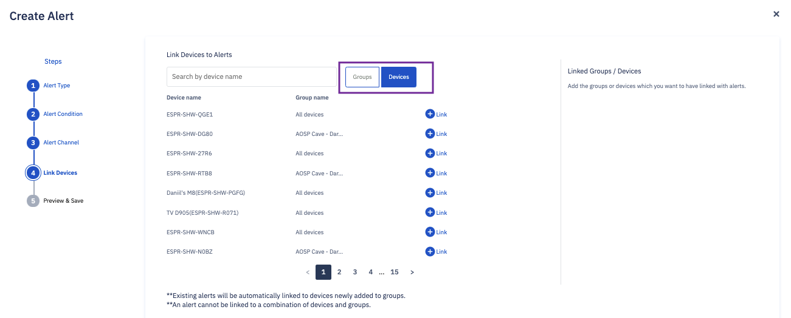

To add a group, click **Groups**, then select the group for which you’d like to see alerts, then click **Next**.

:::tip
An alert cannot be linked to a combination of devices and groups. It needs to be either only devices, or only groups.
:::

Step 7: Preview and Click **Save**. Click **Back** to make changes.

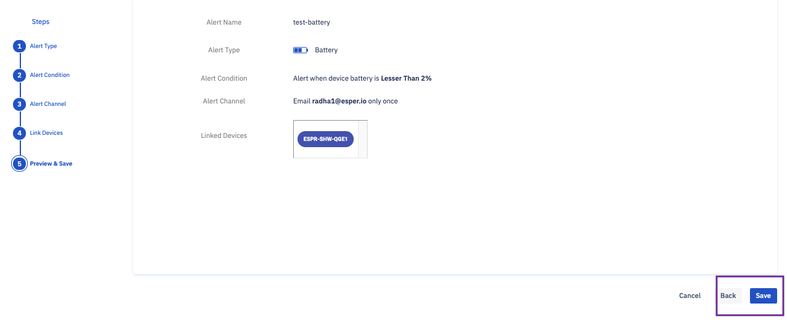

The created alert will be seen on the alerts page.

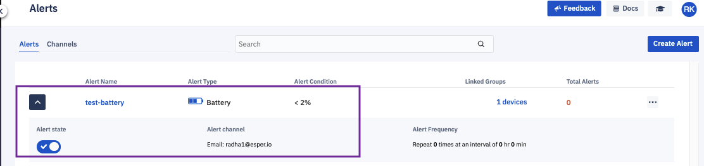
