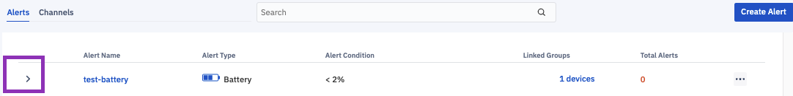
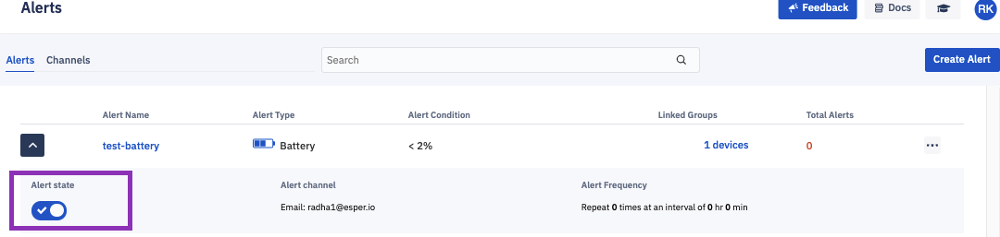
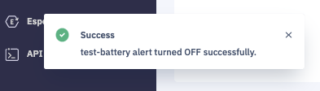

## How to Pause an Alert?

  
Click on the left arrow in the table to show additional details of the alert.

  
  

  

Click on Alert State to turn off the alert. You can turn off the alert and turn it back On.

:::tip
You do not need to delete the alert to turn it off.
:::

  

  

You will get a success toast message and the alert will be turned off.

