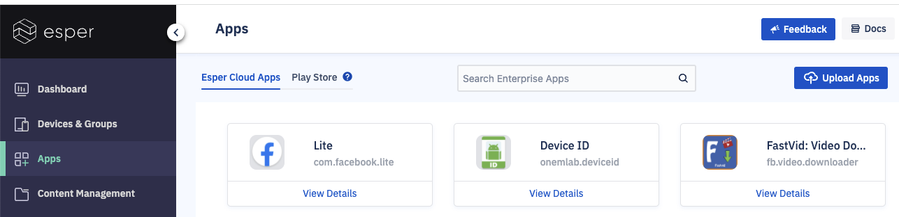

## What is the App Section of the Console?

  

This section enables you to manage the applications used on the Android devices. The devices you manage will only be able to install and use those apps you authorize. In most cases, device users won’t even be able to see anything else.

  

  

There are two different types of Apps you can authorize on your Android devices:

-   Enterprise Apps (APK files)  
    You can upload Android Packages (APKs) for Enterprise apps to the Esper cloud; (APK is the package file format used by the Android operating system for distribution and installation of mobile apps).
    
-   Google Play Apps  
    You can authorize—or disallow—apps from your managed Google Play store.
    

**Note**: You may approve in-ROM apps or Preloaded apps in a device from a Provisioning Template during provisioning by [entering the package name in the Apps screen](https://docs.esper.io/home/console.html#provisioning-templates).