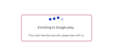
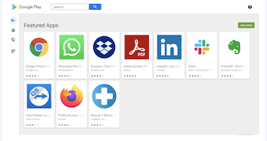

## How to Sign Up for Google Play for Work (EMM Enrollment)?

  

The Esper Console gives you access to Play for Work, the enterprise version of Google Play. Within Play for Work, you can approve applications, which can be downloaded to your GMS devices.

  
:::tip
Google Play deos not support AOSP devices.
:::

  

If you give the users access to the Google Play Store app on the device, you can limit installable applications from the Play Store to Esper-approved applications.

  

:::tip
Google Play is a service provided by Google, Esper does not control the user experience for Google Play.
:::
  

If you have not signed up for Play for Work to create a managed Google Play account for your Esper Endpoint, navigate to **Apps** > **Play Store**.

  

  

:::tip
You will need a Gmail account to create your managed Google Play account. You can not use a G Suite account. A best practice is to use a dedicated Gmail account for this purpose.
:::

Click the **Enroll from Google Play Website** button.

On a Google’s managed Google Play sign up page, click **Sign in.**

Sign in to the Gmail account you intend to use for enrollment.

:::tip
If you are already signed into a G-suite account you will see a slightly different screen asking you to choose a non-G Suite account to continue. Just copy the URL, open a new Incognito window, and go to the URL. You should now see the SIGN IN button. You can then use an existing Gmail account or create a new one as needed.
:::

Fill in the information requested by Google, including your company name, optional contact information for your Data Protection Officer and/or EU Representative. Accept the agreement, and click **Confirm**.

Click Complete **Registration**.

You’ll be navigated to your Esper Endpoint. If you used an Incognito window, you’ll need to log into your Endpoint. If you’re already logged in, you’ll see a screen in Esper indicating enrollment is in process.

Once the process completes, you’ll have Play Store apps available to use with your GMS devices on Esper.

