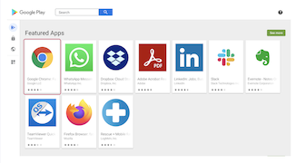

## How to Approve Google Play Apps?

  

The Esper Console gives you access to Play for Work, the enterprise version of Google Play. Within Play for Work, you can approve applications, which can be downloaded to your devices. You can also unapproved applications, which will then cease to be available in the Google Play store on your devices.

  

Step 1: To approve a Google Play app, click 'Play Store.'

  
  

Step 2: Enter the name of the application into the Google Play search box and click the magnifying glass.

  

Step 3: Click the tile for the application.

  

Step 4: Click **Approve**.

  
  
  

Step 5: On the popup, click **Approve**.

  
  
  

Step 6: Select the radio button next to 'how you would like to handle new application permission requests'. Select 'Keep Approved' results in the best user experience. The user will not grant any new permissions on the device; however, you need to trust the application provider if you choose this option. If you'd like to receive an email notification whenever an application requests new permissions, click on the 'Notifications' tab and add your email address in the space provided. Then click **Done**.

  

  
  
  
:::tip
Be sure the application supports the appropriate minimum API level and country for the GMS devices' application. If either of these is mismatched, Google Play will prevent installing the application onto non-conforming devices either during provisioning or while installing from Esper.
:::
