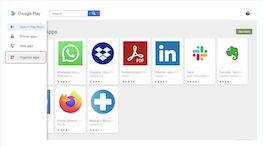

## How to Manage the Visibility of Apps in the Google Play Store?

  

You have control over the applications that appear in the Google Play Store on the devices you manage.

Step 1: In the Esper Console, click **App** in the navigation sidebar and select 'Play Store' tab.

  

Step 2: Hover over the sidebar within the Google Play screen and click **Organize Apps** from the popup menu.

Step 3: Any application listed in the collections on this page will show up in the Google Play Store application on the device.

To remove an application from the collection displayed, click the (x) icon.

To add an application to this collection, click + Add Applications.

To learn more about managing enterprise and google applications on devices, please refer to links below:

[How to manage applications on a single device?](../devices-groups/apps-device.md)

[How to Manage applications on device groups?](../devices-groups/group-apps.md)