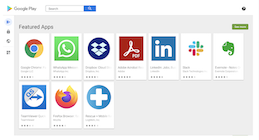

## How to Control Which Apps Show up on the Play Store?

  

You have control over the apps that appear in the Google Play Store on the devices you manage.

Step 1: In the Esper Console, click **Apps** in the navigation sidebar and select play store tab.

  

Step 2: Hover over the sidebar within the Google Play screen and click on **Organize Apps** from the popup menu.

Step 3: Any app listed in the collections on this page will show up in the Google Play Store app on the device.

To remove an app from the collection displayed, click the (x) icon above and to the right of its icon.

To add an app to this collection, click + Add Apps

To learn more about how to manage enterprise and google apps on devices check the below links:

[How to manage apps on a single device.](../devices-groups/aaps-device.md)

[How to Manage apps on device groups](../devices-groups/group-apps.md).