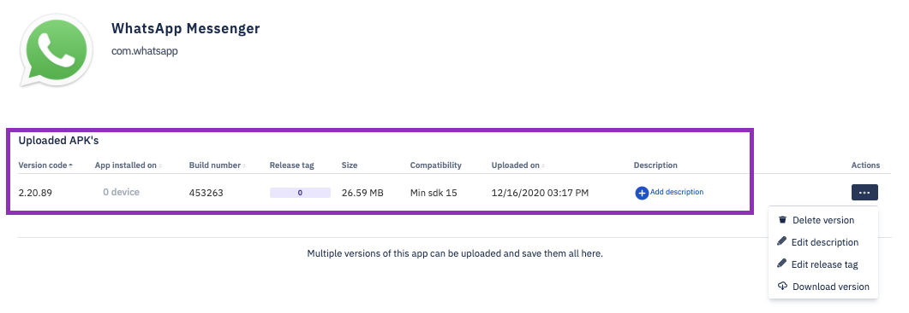

## How to Delete an Application Version From Esper Cloud?

  

If you delete an app version from the Esper Cloud and the app is currently installed on a device or devices managed by Esper, the app will remain installed on the device or devices. If the app version is included in one or more Provisioning Templates, it will be removed from each template when the app is deleted. If this is the case, you will need to confirm the deletion of the app and it will then be removed from any associated Provisioning Templates.

 

  
  
  

A success toast will appear in the bottom left corner of your screen upon successful completion.