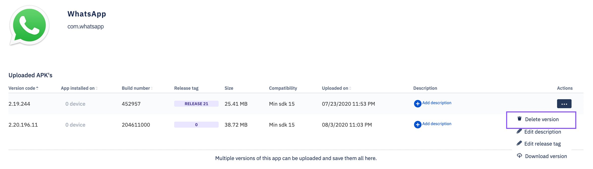

## How to Delete an Application Version From the Esper Cloud?

  

When deleting an application version from the Esper Cloud, if the application is installed on a device(s) managed by Esper, it will remain installed on the device(s). If the application version is included in one or more Provisioning Templates, it will be removed from each template when the application is deleted. 

If you choose to delete the Application version, click the ellipsis and select the 'Delete Version' option. Confirm the deletion, and the application will then be removed from any associated Provisioning Templates.

 

  
  
  

A success/failure toast message will appear in the bottom left corner of your screen.