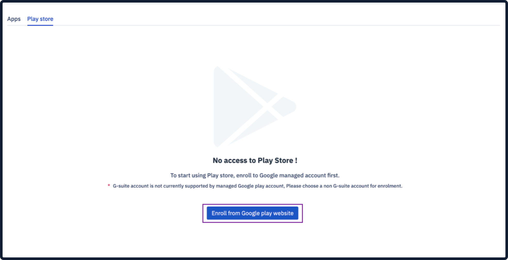
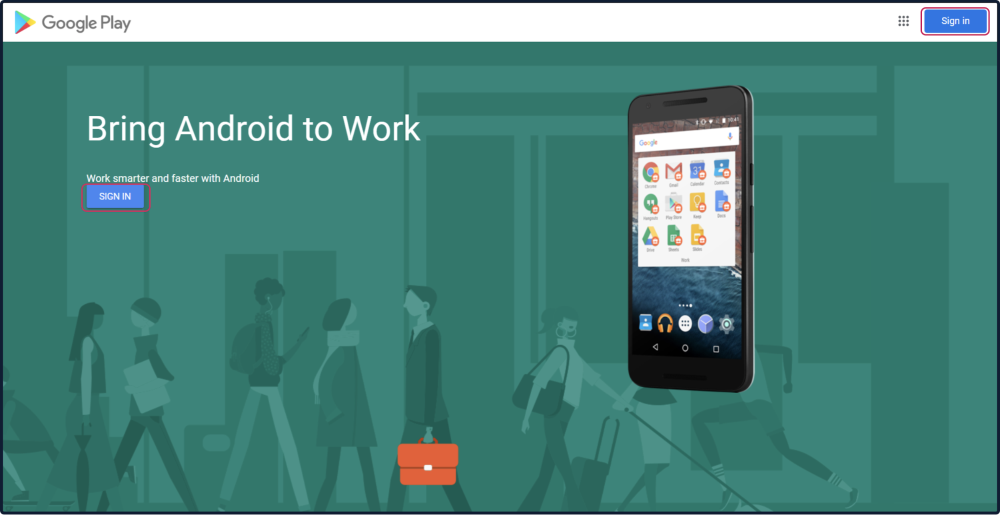
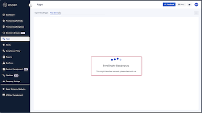
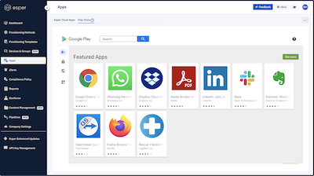

## How to Sign Up for Google Play for Work (EMM Enrollment)?

  

The Esper Console gives you access to Play for Work, the enterprise version of Google Play. Within Play for Work, you can approve apps, which can then be downloaded onto your GMS devices.

  

**Note**: AOSP devices are not supported by Google Play.

  

If you give device users access to the Google Play Store app on the device, you can limit installable apps from the Play Store only to those approved through Esper.

  

**Note**: Google Play is a service provided by Google, Esper does not control the user experience for Google Play.

  

If you have not signed up for Play for Work to create a managed Google Play account for your Esper Endpoint, you’ll see the following screen when you click on **Apps** > **Google Play**.

  

  

**Note**: You will need a Gmail account to create your managed Google Play account. You can not use a G Suite account. A best practice is to use a dedicated Gmail account for this purpose.

Click on the Enroll from **Google play Website** button.

You’ll be taken to a Google’s managed Google Play sign up page. Click **Sign in.**

Sign in to the Gmail account you intend to use for enrollment.

**Note**: If you are already signed into a G-suite account you will see a slightly different screen telling you to choose a non-G Suite account to continue. Just copy the URL, open a new Incognito window, and go to the URL. You should now see the SIGN IN button. You can then use an existing Gmail account or create a new one as needed.

Fill in the information requested by Google, including your company name. Provide the contact information for your Data Protection Officer and/or EU Representative, or leave blank if they don’t apply. Check the box for the agreement, and click Confirm.

Click Complete **Registration**.

You’ll be taken back to your Esper Endpoint. If you used an Incognito window, you’ll need to log into your Endpoint. If you’re already logged in, you’ll see a screen in Esper indicating enrollment is in process.

Once the process completes, you’ll have Play Store apps available to use with your GMS devices on Esper.

