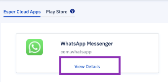

## How to Manage Different Versions of Enterprise Applications on Esper Cloud?

Clicking on **View Details** on an app tile will show details for the app.

  

  

It will show below details:

-   App name
    
-   Package name
    
-   App icon
    
-   Version code (for each version). Note that the same app can have various versions.
    
-   App installed on - the number of devices the app is installed on
    
-   Build number
    
-   Size of the app
    
-   Compatibility with SDK version
    
-   Uploaded on — the date and time the app was uploaded to the Esper Cloud
    
-   App description — an optional field for you to add a description or release notes
    

There is an ellipsis (...) under Actions. Clicking the ellipsis enables you to:

-   Delete the app version from the Esper Cloud
    
-   Edit the description — You can add and edit the description or release notes for each version of the app
    
-   Edit release tag
    
-   Download the app version locally to your PC