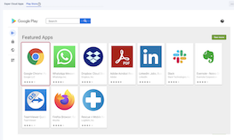
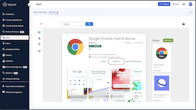

## How to Unapprove Google Play Apps?

  

To unapprove an application, click on the tile for the application.

On the detail screen for the application, click **Unapprove**.

  

**Note**: Unapproving an application does not mean uninstalling it. If the application was approved earlier, it will remain on any device on which it was installed until it is explicitly uninstalled. After uninstalling it, if it has been unapproved, the device user will not be able to reinstall it on the device.