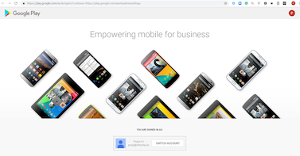
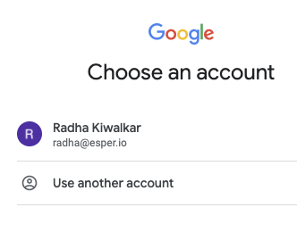
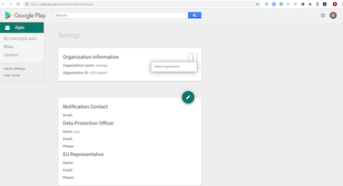

## How to Unsubscribe your Google EMM Account?

If you still wish to unenroll your email from Google Android for Work, get in touch with Esper support at support@esper.io and follow these steps -

Step 1: Go to  [the Google Play Admin Settings page](https://play.google.com/work/adminsettings). If you are already signed in, you will see an option to 'SWITCH ACCOUNTS'. Click on the same to switch to the Gmail id that you had enrolled with.

  

Step 2: Select your account or give login credentials.

  

Step 3: Under Settings, you will see the Organization information section. Click on the vertical ellipsis on the right. You will see an option to “Delete Organization”. Clicking this will disassociate your email with the said organization.

***Warning:** If you delete your organization from google EMM enrollment, Esper does not get this information from Google and hence it will cause the failure of provisioning when Esper will try to reach Google for setting up the device. It is highly advised that admin does NOT unenroll their Gmail ids from Google without consulting Esper support at support@esper.io.*