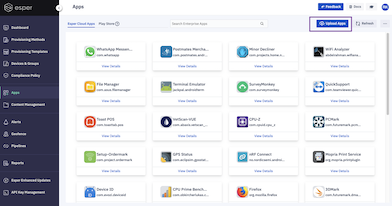
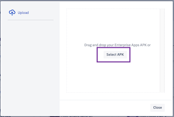
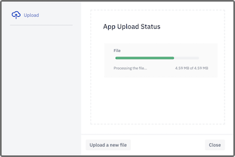
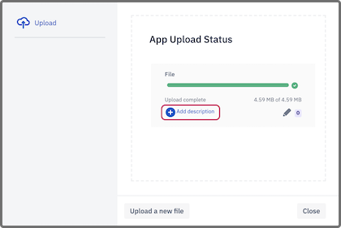
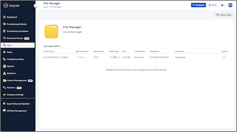

## How to Upload an Enterprise Application to the Esper Cloud?

  

To upload an APK for an Enterprise application to the Esper cloud perform the following:

  

Step 1: Click **Upload Apps** in the top right corner of the screen.

  

  

Step 2: In a popup box,  drag the APK file for your Enterprise application or select the file from your computer; click **Select APK**.  The system will allow you to browse and choose the APK file. Select the desired file from your local computer.

  

  
  

Step 3: A screen will display a message "The application’s upload is in progress."

  

  

Step 4: When the upload completes, you will notice an automatically generated release tag and an option to add a description. Here you can add text describing the application and then click **Save**. On clicking the edit icon, you will get an option to edit the release tag. When done, click **Save**.
  

:::tip
Adding a description and a release tag is optional; you can skip this step and directly go to the next step.
:::

  

  
  

Step 5: Click **Close** or click outside of the window to exit the 'Application Upload' screen.  Once successfully uploaded,  the "Esper Cloud Apps" section will show your Enterprise application.

### APK file upload conditions

All application APK files must adhere to certain conditions to succeed in uploading and provisioning:

-   The APK must have a unique version name and number.
-   The APK cannot be larger than 500 MB.
-   The APK file itself must have the .apk extension.
-   The APK file must include signature verification.
-   The application cannot set itself as the default launcher; this will cause conflict with the Esper Agent (DPC).
-   The application must adhere to the latest Android APK standards (currently we allow APKs without icons).
    

If you attempt to upload an APK file that has a V2 or V3 signature, but not a V1 signature, it will be rejected. Older Android platforms—those running Marshmallow (6.0) and earlier—require v1 signatures.