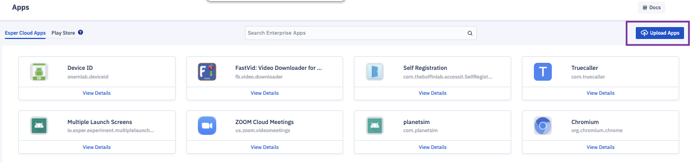

## How to Upload an Enterprise Application to Esper Cloud?

  

To upload an APK for an Enterprise app to the Esper cloud perform the following:

  

Step 1: Click on **Upload Apps** in the top right corner of the screen.

  

  

Step 2: A popup box will appear into which you can drag the APK file for your Enterprise app; to select the file from your computer, click on **Select APK**. On clicking select APK, the system will allow you to browse and choose the APK file. Select the desired file from your local computer.

  

  
  

Step 3: A screen will display the app’s upload is in progress.

  

  

Step 4: When the progress bar completes, you will notice an automatically generated release tag as well as an option to add a description. On clicking add description, a user can add text describing the app and then click on **Save**. On clicking the edit icon, the user will get an option to edit the release tag. Once you are done click on **Save**.

  

**Note**: This is an optional step. You can skip adding a description and a release tag and go to the next step.

  

  
  

Step 5: Click **Close** or click outside of the window to exit the app upload screen. This will complete the app upload. Once successful uploaded, your Enterprise app will be shown under the “Uploaded Apps” section.

### APK file upload conditions

All app APK files must adhere to certain conditions to succeed in uploading and provisioning:

-   The APK must have a unique version name and number.
    
-   The APK cannot be larger than 500 MB.
    
-   The APK file itself must have the .apk extension.
    
-   The APK file must include signature verification.
    
-   The app cannot set itself as the default launcher; this will cause conflict with the Esper Agent (DPC).
    
-   The app must adhere to the latest Android APK standards (currently we allow APKs without icons).
    

If you attempt to upload an APK file that has a V2 or V3 signature, but not a V1 signature, it will be rejected. Older Android platforms—those running Marshmallow (6.0) and earlier—require v1 signatures.