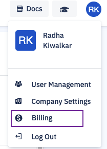
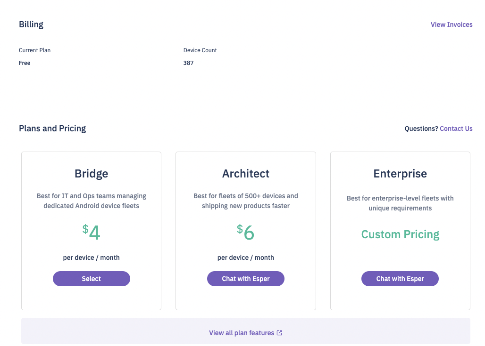
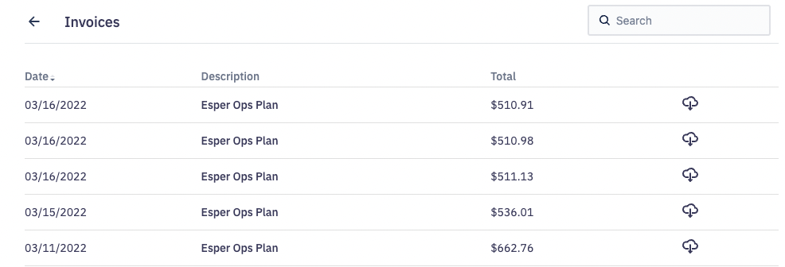
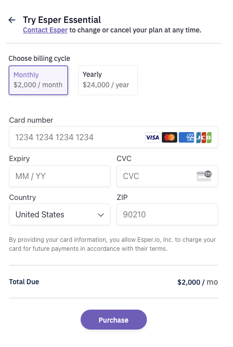

# What is the Billing Section?

  

Billing is a section in the Console to help users purchase the Bridge plan, our basic MDM-catered offering.

  
:::tip
Only Enterprise Admin users will be able to purchase this plan. Enterprise viewer user role will be able to view the plan. It will not be accessible to Viewer and the Group Viewer user roles.
:::
  

On the Console, click the profile icon and choose the ‘Billing’option from the menu.

The landing page displays the current plan, the number of devices onboarded, and the start date.

Click the **View Invoice** link to view past purchases.

  

Here, you can purchase the Bridge plan. Click **Select**, and a typical payment modal is displayed. You can choose the monthly or the annual plan.

  

You can upgrade to Architect and Enterprise plans anytime. [Esper Sales](https://www.esper.io/contact-us) team will be happy to help!