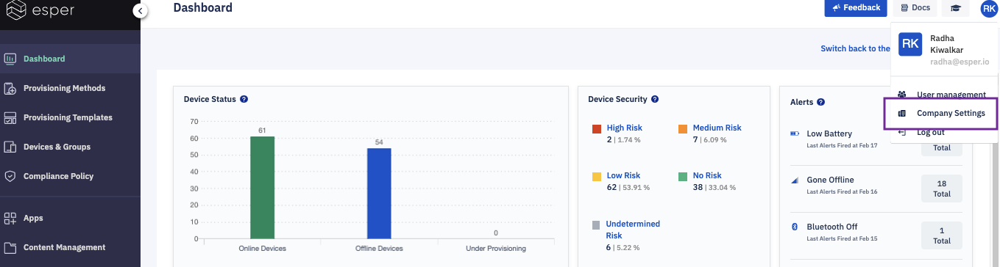

## What are Company Settings?

  

The Company Settings section displays your company’s information. To access the Company Settings, click the profile icon and choose the 'Company Settings' from the drop menu.

  

Please enter the following company information to complete all fields:

-   Registered name
-   Location
-   Name
-   Zip code
-   Primary Email
-   Address
-   Phone number