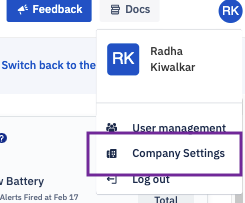

## What are Company Settings?

  To access the Company Settings, click the profile icon and choose the 'Company Settings' from the drop menu.

  

The Company Settings section displays your company’s information.

Enhanced Onboarding Security: If enabled, manual record registration or onboarding approval is required for each device. If disabled, all devices may onboard to the directory without requiring approval.