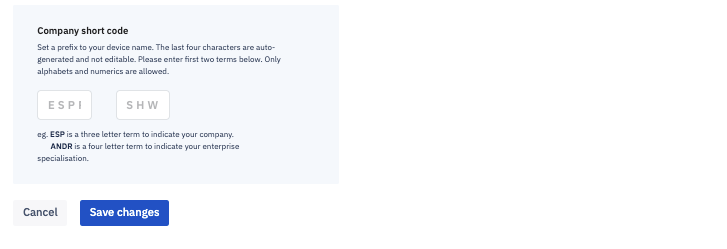
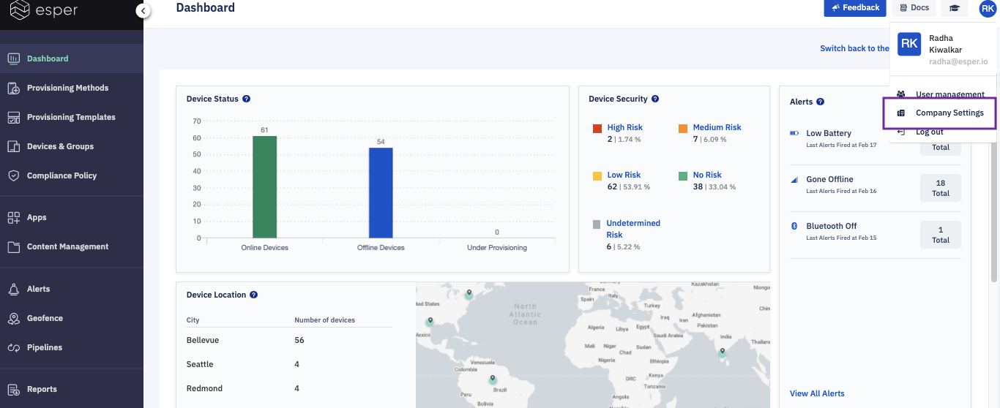
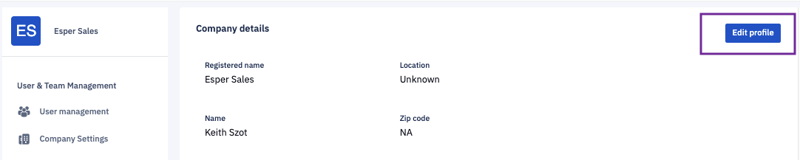

## How to Add or Modify the Company Code?

You can enter two 3-letter codes called short code in the 'Company Settings' tab. Short codes can be an abbreviation for your company name and location. You can also customize the code. 

:::tip
Your short codes become a prefix to the name of all devices you control in Esper.
:::

In this example, ESP is a three-letter abbreviation for our company, Esper. DOC signifies the documentation team.

:::tip
You can change your shortcode after onboarding devices. The devices onboarded before the change will display the old shortcode prefix. The new shortcode will be displayed in the Esper Console and used for API, SDK, and CLI calls. 
:::

Step 1: Click the profile icon at the top right corner of the Console. Choose ‘Company Settings’ from the drop down.

  

  
  

Step 2: Click the **Edit Profile** button and make the necessary changes to your profile and then click **Save**.

  

