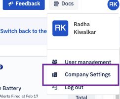

## How to Edit the Company Profile?

Step 1: Click the profile icon at the top right corner of the Console. Choose ‘Company Settings’ from the drop down.

  

  
  

Step 2: Click the **Edit Profile** button and start editing your profile and then click **Save** when you are done editing.

  

