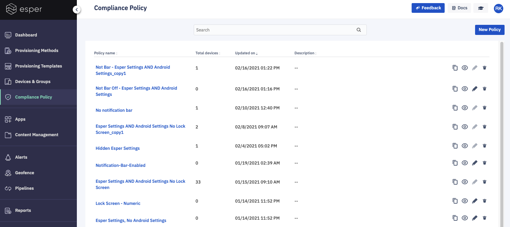

## What is a Compliance Policy?

  

A Compliance Policy is a set of permissions related to the device configurations that can be applied to devices managed by Esper. The Compliance Policy section enables you to create a policy that sets these parameters. 

  

  

The Compliance Policy section lists all the policies that are already created. For each listing, you have the following options:  

-   Duplicate the Policy (two pages icon)- Clicking this icon duplicates an existing compliance policy.
-   View the Policy (eye icon)- Clicking this icon, you can view an existing compliance policy.
-   Edit the Policy (pencil icon)- Clicking this icon, you can make changes to an existing compliance policy. 

:::tip
Once the policy has been applied to a device(s), it cannot be changed and this option will be greyed out.
:::
-   Delete the Policy (trash can icon)- Clicking this icon deletes a policy.
    

Use search (by name) to find an already created compliance policy.
