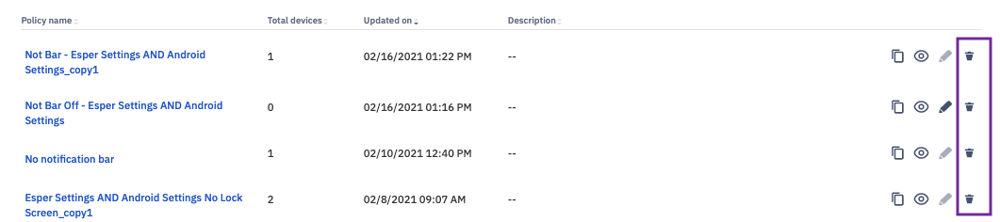

## How to Delete a Policy?

If you’d like to delete an existing compliance policy, click the delete icon (dustbin) in the 'Compliance Policy' list view.

  

A confirmation pop-up will appear before the system actually deletes the compliance policy. Click **Confirm** to remove the policy. In order to delete a policy make sure it is not linked to any device.

  