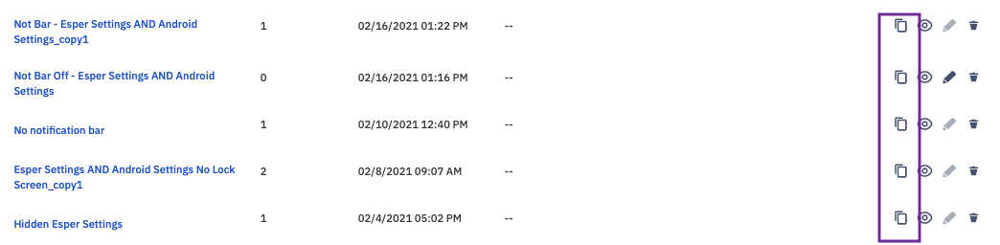

## How to Duplicate a Policy?

  

If you’d like to base a new Compliance Policy on an existing Compliance Policy, click on the copy icon (two boxes) in the Compliance Policy list view. You can then edit, rename, and modify the duplicate policy.

  

