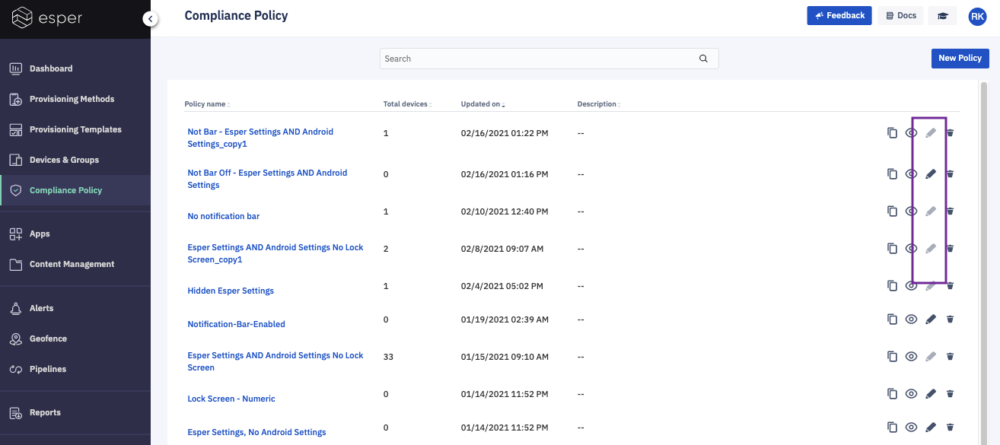

## How to Edit a Policy?

  

If you’d like to edit an existing Compliance Policy, click on the Edit icon (pencil) in the Compliance Policy list view.

  

  

When a Compliance Policy is applied to devices, it can’t be edited. The icon will be displayed in gray on the menu.