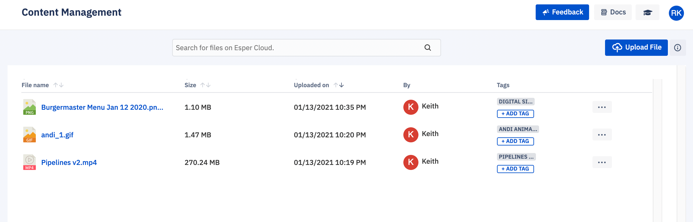

## What is Content Management?

You can upload or transfer file(s) up to 2 GB, including config files and other file formats, to devices and device groups. Now, you can:

-   Store files in Esper’s cloud console.
    
-   See the file transfer history for devices or device groups.
    
-   View file transfer status (success, failure, or in progress) and status details.
    

Please note that for large files being transferred to a large number of devices, the process can take a long time to complete. You can use the Activity Feed covered below to get details on the status of any file transfer

