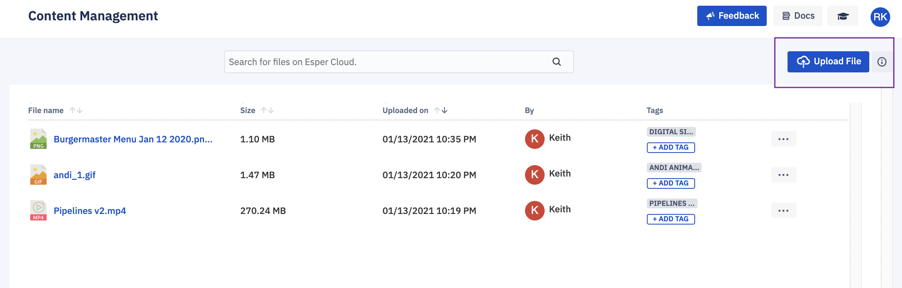
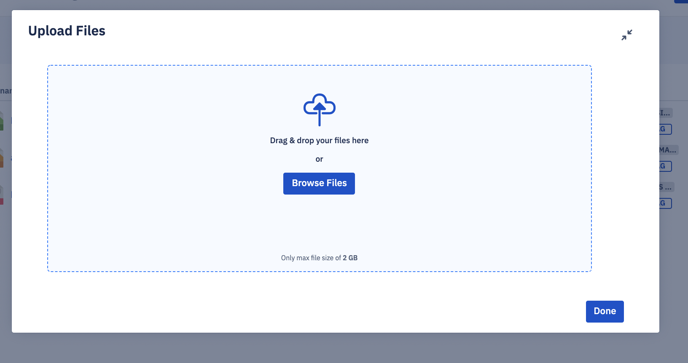
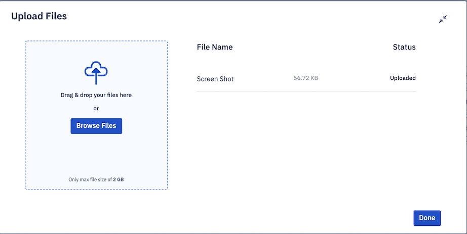
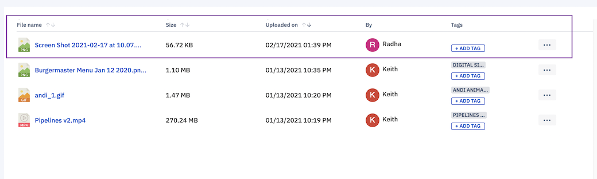

## How to Upload Content to the Esper Console?

  

Step 1: The first step is uploading the file to the Esper Cloud. Simply click **Upload File**.

  

  
  

Step 2: You can drag a file or browse for the desired file.

  
  

  

Step 3: After you have uploaded a file to the system below screen view will appear and you can upload more files if you wish.

  

  
  
  

Step 4: On successful upload, you will see the file in the list.

  

