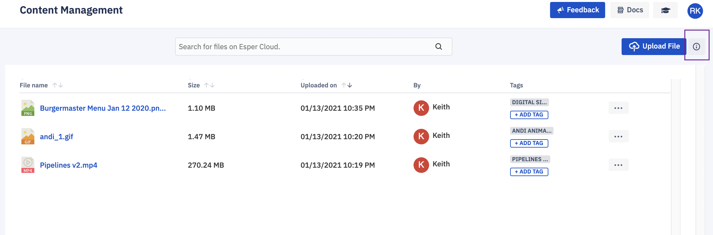
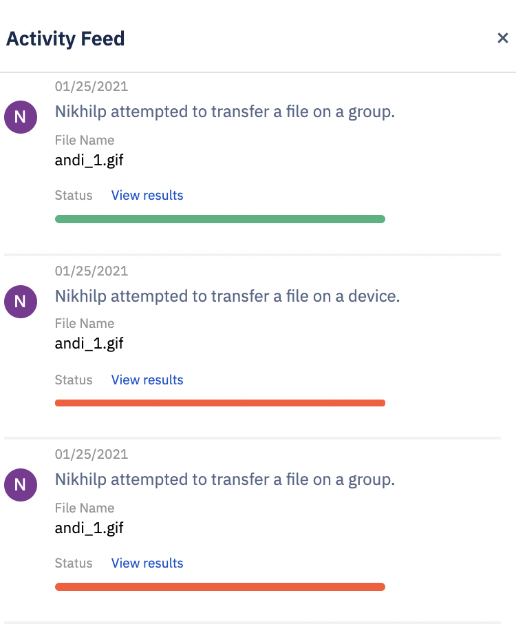
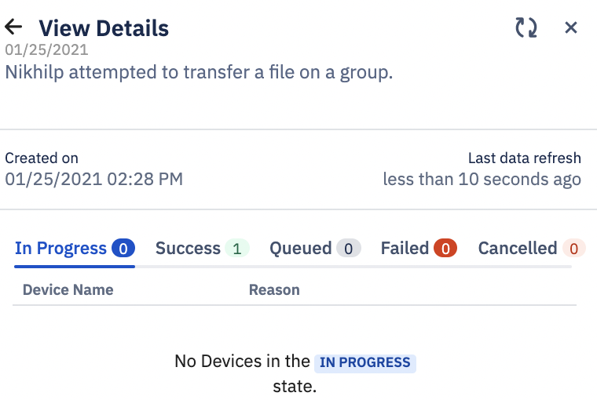

## How to Check Transfer History and Status of the File Transfer?

  

To see the status of a transfer in the Activity Feed, click on the information icon on the upper right-hand corner of the ‘Content Management’ screen.

  

A slide-out from the right will show you the status of each transfer. Click on View Results link to see more details for a transfer.

  
