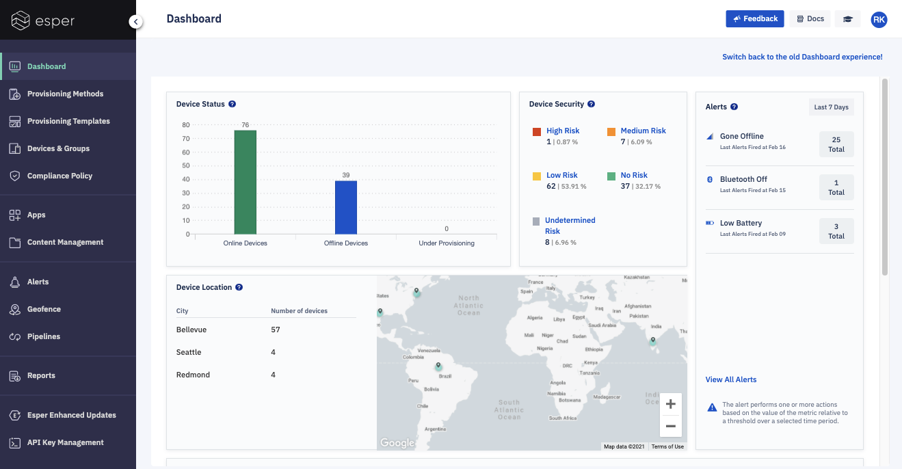
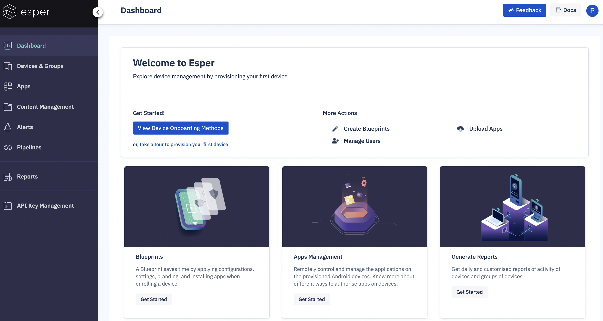

# What is the Dashboard? 

## Overview

When you enter the Esper Console, the first page you encounter is the Dashboard. It acts like the homepage for the Console and provides useful, at-a-glance information about the status of your Android device fleet.

  

  
  

The first time you log in to the Esper Console, a default screen will be displayed indicating you do not have any devices enrolled. From this screen, you will be encouraged to provision a device or simulate a device.

  

If you’d like to simulate an Android device, click **Simulate Device**. A notification will appear, displaying a success message with the text, "You are all set!" A mock device will then be available for you to experiment with Esper and to learn how Esper interacts with devices.

**Notes**:

1.  Capabilities such as Apps, Remote View, and Capture Log may not be available on a simulated device.
    
2.  The Simulate feature is only available on accounts created after Friday, September 27, 2019. If you became an Esper client before then and would like access to a simulated device, please contact us at support@esper.io.
    

Once you provision your first device, this screen changes to the full Dashboard view.