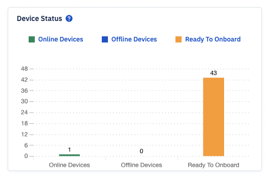

## What are the Dashboard components?

The Dashboard mainly hosts the status panel. It also has a section to display the recent pipeline activities. It has other static components like the navigation menu on the left. The top-right corner has quick links to the Esper Console documentation and the Learning Center.

  

### Status Panels

The main body of the Dashboard contains the following status panels:

#### Device Status

The Device status panel shows the current deployment status of all your devices, with the number of devices in each of three possible statuses: online devices, offline devices, and under-provisioning. Clicking one of these bars will take you to the Device Dashboard section, filtered to show the devices under the selected status.

#### Device Security

The Device Security panel provides a snapshot of the security status of all your deployed devices, with the following possible statuses available for a device: high risk, medium risk, low risk, no risk, or undetermined risk. Clicking on one of these statuses will take you to the Device Dashboard section, filtered to show you the devices in the risk category indicated.

You can learn more about the device security [here](../devices-groups/device-security.md).

#### Device Location

The Device Location panel shows the physical location reported by each of your devices on a map.

#### Alert

The Alerts panel provides a summary of alerts you’ve created in the last 7 days. It displays the name of the alert and the number of times each has fired. When you click on the name of the alert, you will be taken to the alert section to view the details.

  

### Recent Pipelines

This status panel holds a summary of the tasks in the pipeline. It displays the information about the name, id of the job in the pipeline along with the status of the job. When you click on the View Run button or the Run Id link, you will be taken to the pipeline section where you can view the details.

  

