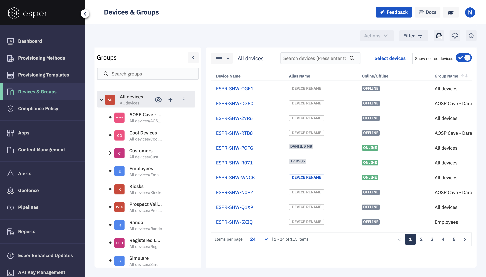
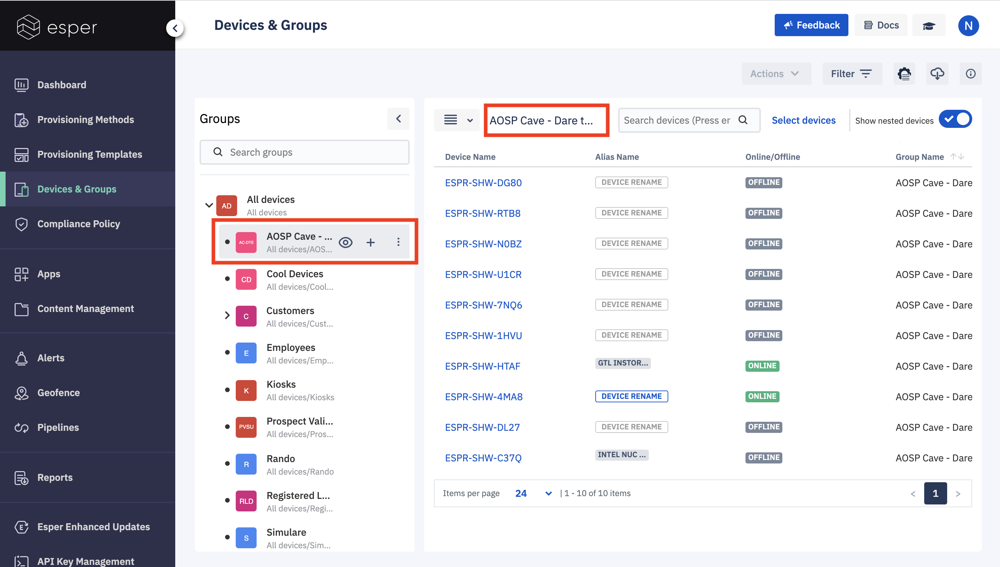
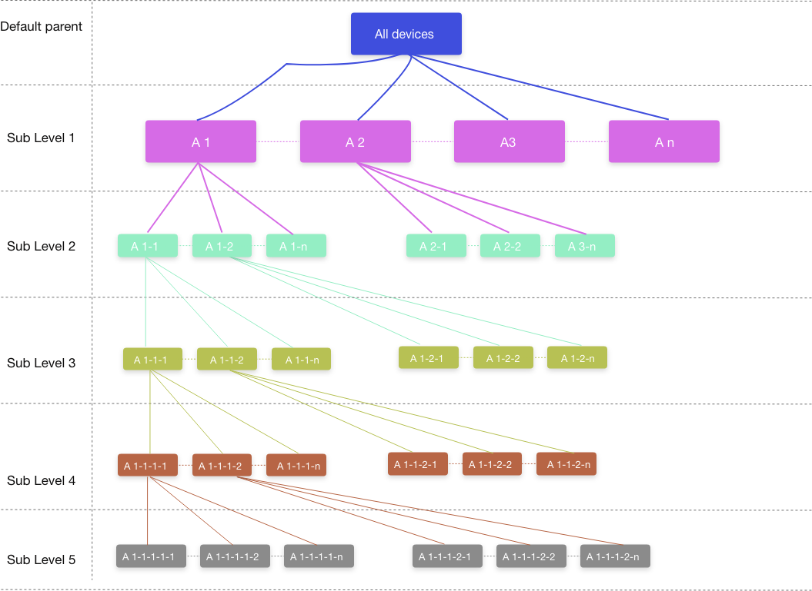
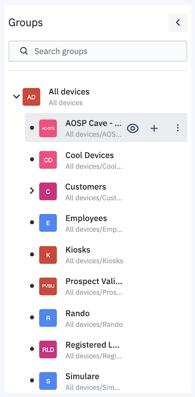
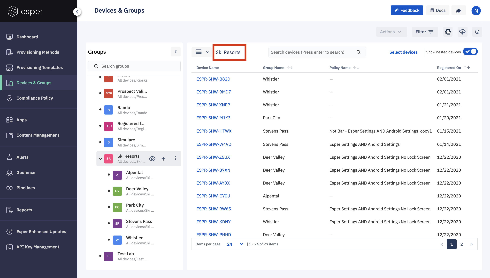

## What is the Devices & Groups Section?

The Devices & Groups section enables you to manage devices and groups in one place. You can assign devices to groups or move devices/groups from one group to another. Once the devices are assigned to groups, you can use a single command to perform an action on all the devices in the group. You can, for example, apply a compliance policy to all the devices in the group at once.

  

Once your devices are enrolled to Esper or simulated devices are added, the Devices and Groups view will list all the devices and group structure. You can see all your groups in a nested structure on the left pane of the screen. For a selected group, you can see all the associated devices on the right pane.

  

  

###  Nested Groups

We provide the capability of “Nested Groups”, which is essentially a hierarchical structure of groups that enhances the flexibility of taking actions on the devices. Thus introducing two more concepts:

-   Parent Group - A group at a higher level of the hierarchy. Users can create multiple parent groups at the same level.
-   Subgroup - A group at a lower level of hierarchy associated with a parent group. Any action intended for a parent group will be cascaded to all sub-groups as well.
    

  
  

You can create nested groups at any level. You can create a maximum of 5 sub-levels to any parent device group. You can create as many as parents you want. By default, there is always one super parent group named “ All Devices.” Devices are automatically added to this group unless otherwise specified during provisioning via a template. You cannot delete the “All Devices” group.

  

  
  

### Groups Pane

As groups may be deeply nested, the Groups pane has a dynamic horizontal scroll bar to pull groups and their options into view. You can resize the pane by hovering over the vertical bar separating the Groups and Devices panes. You can use the left pointer to collapse the Groups pane to give you the maximum view for the Devices Pane.

### Device Pane

All the devices in a selected group wilol be displayed on the right Devices pane.

Click on the name of the device to acces the device's details.

  
  

To return back to the main Devices & Groups page, simply click the back arrow next to the Group name at the top.

  
