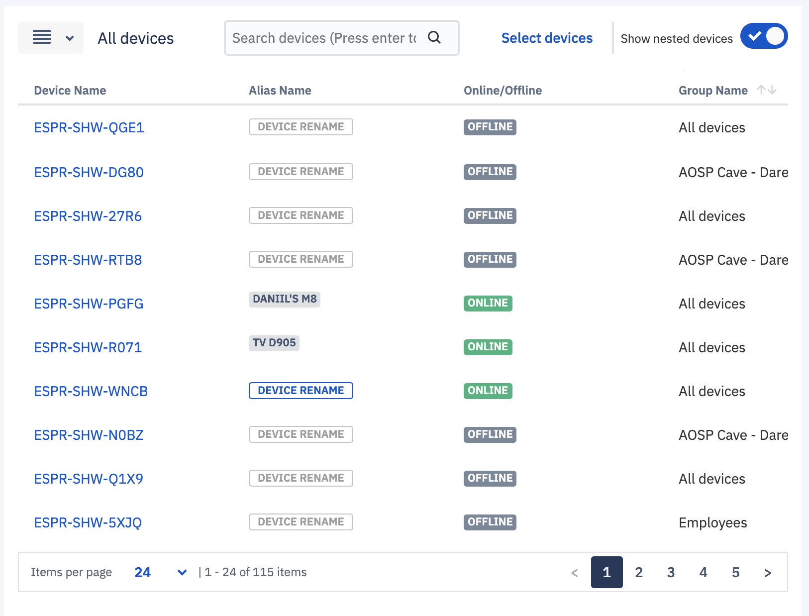

## What are Devices and Groups?

The Devices & Groups section enables you to manage devices and groups in one place. You can assign devices to groups or move devices/groups from one group to another. Once devices are assigned to groups, you can use a single command to perform an action on all the devices in the group. You can, for example, apply a Compliance Policy to all the devices in the group at once.

  

Once you’ve added actual or simulated devices to the Console, the Devices and Groups view will list all the devices and group structure. On the left side of the screen, you can see all your device groups in a nested structure. And on the right side of the screen you can see all the devices associated with the selected group on left.

  

  

### H3 Nested Groups

We also provide the capability of “Nested Groups” which is essentially a hierarchical structure of groups that enhances the flexibility of taking actions for devices. Thus introducing two more concepts:

-   Parent Group - A group at a higher level of the hierarchy. Users can create multiple parent groups at the same level.
    
-   Subgroup - A group at a lower level of hierarchy associated with a parent group. Any action intended for a parent group will be cascaded to all sub-groups as well.
    

  
  

Nested groups can be created at any level. You can create a maximum of 5 sub-levels to any parent device group. You can create as many as parents you want. By default, there is always one super parent group named “ All devices ”. devices are automatically added to this group unless otherwise specified during provisioning via a template. “All device” groups cannot be deleted.

  

  
  

### H3 Groups Pane

As groups may be deeply nested, the Groups pane has a dynamic horizontal scroll bar that will appear to be able to pull those groups and their options into view. You can resize the pane by hovering over the vertical bar separating the Groups and Devices panes. You can also use the left pointer to collapse the Groups pane to give you the maximum view for the Devices Pane.

To view all the devices in a group, click on a device in the Devices pane. All the devices will be displayed in the right device pane.

  

