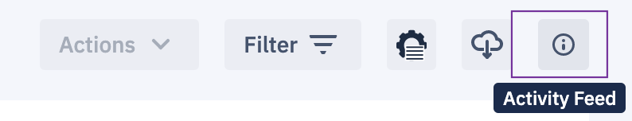
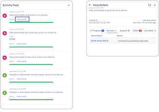

## How to Check Activity Feed on the Devices and Groups Section?

Clicking the Activity Feed icon brings a context-sensitive slide out from the right side of the screen.

  

  

If you are viewing a group, it lists the history of all commands fired by any user to the devices in the group.

