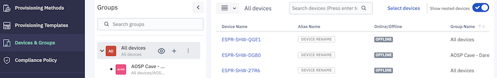
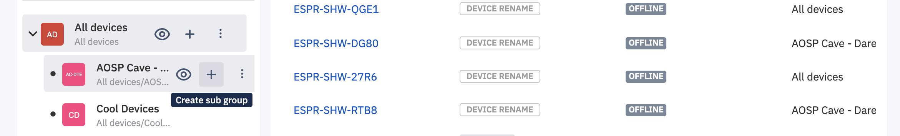
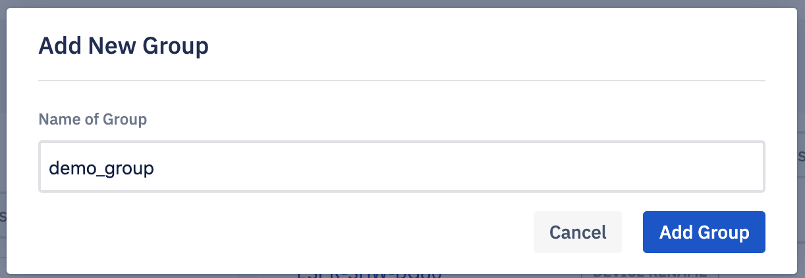
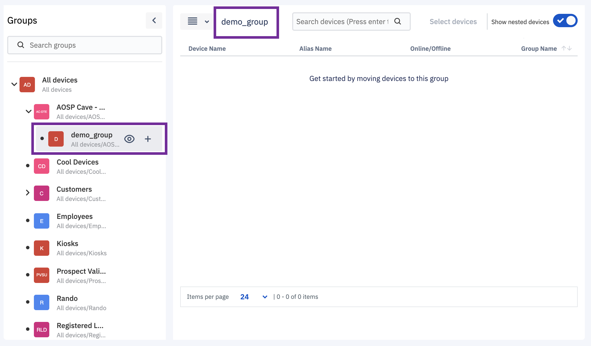

## How to Add a New Device Group?

  

Device subgroups can be added at any level on the basis of how you have structured your nested groups.

  

Step 1: Identify the nested group level where you wish to add a subgroup.

  

  
  
  

Step 2: Hover over the identified group to see the + icon and click on it.

  
  

  

Step 3: Enter the name of the group and click on the **Add group** button.

  

  

A toast message at the bottom will indicate success or failure to create a group. On success, this new group created will be displayed under the parent group you choose.

  

  

**Note**: You cannot add more than 5 levels of subgroups. Before adding a new subgroup check at what level of nested structure you are at. If you are already at 5, then the ‘+’ icon will be disabled.