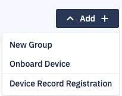
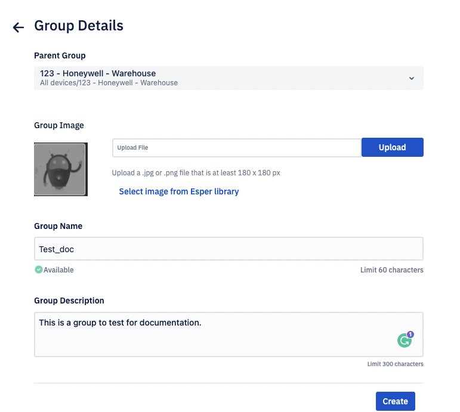
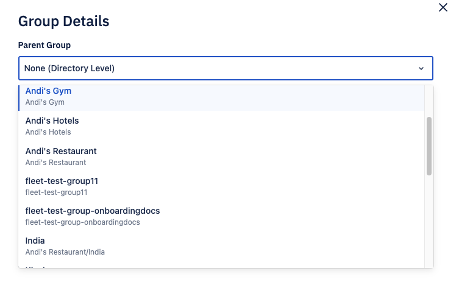

# How to Add a New Group?

Navigate to the Devices & Groups section of the Console. Click **Add**. Choose New Group from the following options:

:::tip
If you onboard a device to a group before you add a blueprint, the device will inherit the  [default settings](/blueprint_default_values.pdf). You can use this blueprint or add a new one.
:::

On the modal, enter the group details.

From the drop-down, select the Parent Group or the Directory for this newly created group.

:::tip
If you choose to create a group under the Directory, it will create a new Parent Group. If you wish you create a new sub-group, please choose a Parent Group.
:::

You can upload an image for the group or select an image from the Esper library.

:::tip
The uploaded image must be in a .jpg or .png format and at least 180 x 180 px.
:::

Enter the group name and the description and click **Create**.

You will be navigated into the newly created group, where you can add subgroups or devices to the created group.

:::tip
To delete a group, click the ellipsis (in list: group view) corresponding to the group and choose delete. You can delete a group only when it does not have any onboarded devices. 
:::

