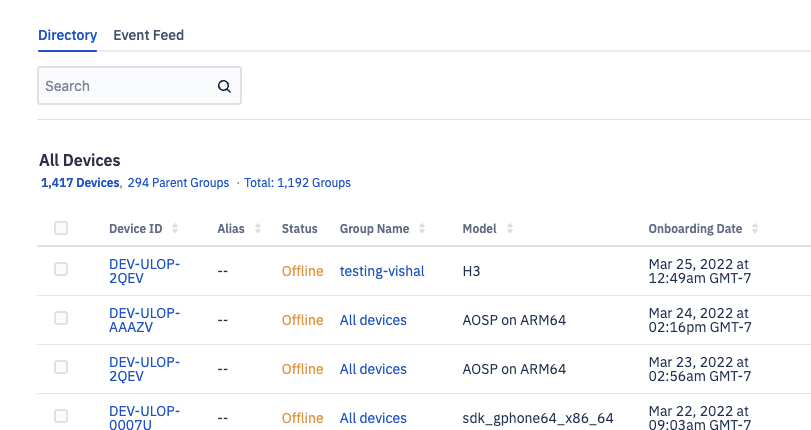
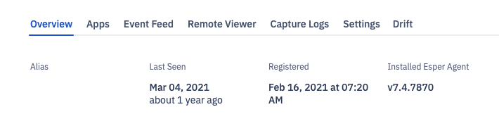

##  How to Find the Esper Agent Version for the Device?

Step 1: Navigate to the 'Devices and Groups' section of the Console. Switch to the [device view](./view.md). 
Select the device for which you want to view the Esper Agent version. Click a device id.

  

Step 2: The Esper Agent Version will be listed in the overview tab.

  

