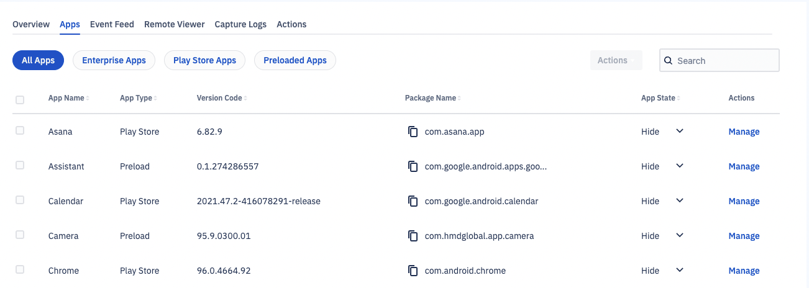
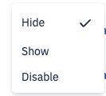
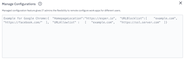
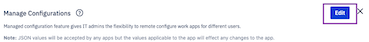
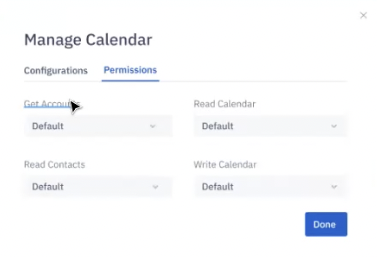
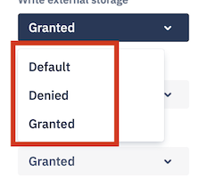
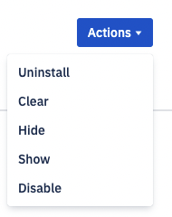

# How to Manage Applications on a Device?

On the device view, navigate to the "Apps" tab. This section lists the applications that are installed on the device. For each application, the information about the Application Name, the Application Type, the Version Code, the Package Name, and the Application State are displayed.



You can search for a particular application by entering part or entire application name.

The applications that are already installed on the device are specified in this list with the following filters:

-   All Apps- All applications installed on the device.
    
-   Enterprise Applications- Private applications that are installed using the [Esper Cloud](https://console-docs.esper.io/apps/upload-apps.html).
    
-   Play Store Apps- Google applications installed using your managed Google Play account.
    
-   Preloaded Applications- Applications that were pre-installed by the device maker in ROM.
    


### [#](https://console-docs.esper.io/devices-groups/apps-device.html#set-an-application-state-on-the-device-from-the-console)Set an Application State on the Device from the Console

An Application can have 3 states: Show, Hide, and Disable.

-   Show state: Show state keeps the application accessible directly and indirectly on your device, which means the user can access the application directly on your device or via some other application.
    
-   Hide state: If an application is set to 'Hide', it can still run in the background.
    
-   Disable state: If you want to prevent an application from running, use ‘Disable’. Disable state is helpful for in-ROM applications that you cannot uninstall. This state prevents the running of such applications and avoids impacting the user experience. It ensures no needless data consumption.
    

:::tip
In-ROM (preloaded) applications cannot be uninstalled. They can be hidden.
:::

Click Actions and select the app state from the drop-down as a group action when you choose multiple applications.



Alternatively, you can select the app state from the ‘App State’ column for individual applications.


:::tip
You will be able to track progress in the event log.
:::


### Manage Configurations for Existing Applications on a Device from the Console

Manage configuration gives the admins the flexibility to manage work applications from the Console. For an application, click the ‘manage’ link.

On the pop-up under the Configurations tab, type the JSON code for the key-value pair.



Following is a sample code for Chrome (version 86 and above) Manage Configuration:

```java
{"URLBlocklist":[

    "example.com",

"https://ssl.server.com",

"hosting.com/bad_path",

"https://server:8080/path",

".exact.hostname.com",

"file://*",

"custom_scheme:*",

"*"],

"SafeBrowsingProtectionLevel":1,

"HomepageLocation":"https://www.chromium.org", "CookiesBlockedForUrls":[

"https://www.example.com",

"[*.]example.edu"

],

"DefaultGeolocationSetting":3

}
```

Following is a sample code for Chrome (Version below 86) Manage Configuration:

```java
{"URLBlacklist":[

"example.com",

"https://ssl.server.com",

"hosting.com/bad_path",

"https://server:8080/path",

".exact.hostname.com",

"file://*",

"custom_scheme:*",

"*"],

"SafeBrowsingProtectionLevel":1,

  

"HomepageLocation":"https://www.chromium.org", "CookiesBlockedForUrls":[

"https://www.example.com",

"[*.]example.edu"

],

"DefaultGeolocationSetting":3

}
```
Click Apply Changes to save the changes. If you have managed configurations applied for an application, you will be able to edit the configurations. Only valid key-value pairs will be applied to the application.



A toast message will indicate success or failure for the action.

For an application, click the ‘manage’ link. On the pop-up under the Permission tab, you will be able to edit application permissions.

Application permissions allow users to configure multiple permissions state on a device like camera access to an application, read and write to external storage permissions, contacts access ad accounts permissions.



You can change the following permissions:

-   Read Contacts
    
-   Get Accounts
    
-   Read Calendar
    
-   Write Calendar
    

You have three options for each attribute to choose from for app permissions viz Default, Denied, and Granted.



### Clear the Application Data on the Device from the Console

This is a group action available when multiple applications are selected. Esper provides users a way to clear application data from the Console on their device.

To access the “Clear data”, select multiple applications and click the Actions. Select the “Clear” option from the drop-down.



This will send a request to the device to clear application data. Upon success, you will get a successful response message where you will be able to apply view the queued request.
