# What are the different Blueprint settings?

When you click the Blueprint link, you will view/edit various categories of the settings depending on your selection. To Navigate to a different setting category, simply choose a different option from the drop-down.

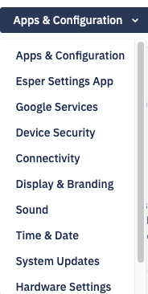

  

<!-- Note: The lock Section link helps you lock the selected section of the Blueprint. Once locked, other Blueprints cannot override it, and the child devices and groups will inherit that sections. -->

## Apps & Configurations

### Default App Permissions

  

Default App Permissions determine enforcement of the runtime rules across all the apps on a device, including Enterprise applications installed by Esper, in-ROM applications that are enabled, as well as applications installed via Managed Google Play. This ensures you can control the user experience on the device regarding how run-time permissions are granted.

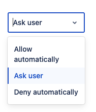

There are three possible settings:

-   Allow Automatically: This rule will grant all the permissions for any application requests without showing a prompt to the user. Allow automatically is the typical setting used for single-purpose solutions using a fully trusted, customer-supplied application.
    
-   Ask User: This keeps the default behavior intact about permission management. All applications on the device will show a prompt to the user to request permission. For example, each time before accessing a device module, all applications will prompt the user with a message such as “Allow application X to access Gallery? Allow/Deny. Ask user options might not be ideal in some solutions, especially Kiosk-based applications. It can help certain unusual situations dealing with App permissions— contact us directly to find out more.
    
-   Deny Automatically: This rule will deny any permission request from any application on the device. The Console will not notify the user. You can  [grant permissions to applications individually](https://console-docs.esper.io/apps/control.html)  from the Esper Console.
    

### Local Application Install Configuration via Policy

This toggle button allows the installation of applications from unknown sources on the device. To enable this on the device, the user needs to follow these instructions. Settings >Apps and Notifications > Special App Permissions> Install Unknown Applications and choose the route from which they wish to install the applications.

For example, if the device user chooses Chrome, they will download and install applications from the Chrome browser on the device. If turned Off, the device user will not be allowed to install applications from any unknown sources.

### Application Uninstall

This feature blocks the device user from uninstalling an app. For devices below Andriod 6.0, the toggle button is turned Off will block app uninstallation. This is especially important for private apps.

Note: Application Uninstall setting is not needed if you are running Android 6.0 or above.

### Device Mode

The Device mode function enables you to switch a device between Multi-app mode and Kiosk mode. When a device is in Multi-app mode, the user can see and use multiple approved apps through the Esper home screen. When a device is in Kiosk mode, the device acts as a kiosk, and users can use only one kiosk app.

Often, onboarding Kiosk-mode devices with additional applications prove to be useful for setup and diagnostics at customer sites. Device mode makes it easy to switch out of Kiosk mode to make those applications available for use by a field technician or customer, and then switch back into Kiosk mode when done. Use the drop-down for Device Mode to switch between the Mulip-app mode and the Kiosk mode.

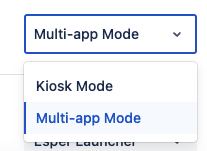

Note: If a device provisioned in Kiosk mode cannot connect to the Internet, the Esper Dock can open the Esper Settings application giving access to Wi-Fi settings locally on the device.

### Launcher

You can choose between the Esper launcher or the Android launcher. Most users will use the default setting: The Esper Launcher. This will take administrative control of the device, and only approved applications will be installed or used. All the features of Esper Agents will be functional. This gives you more control over the applications that can be used and the actions that can be taken on the device.

If you select the Android Launcher, the device user will be able to exit the Esper Agent as they would close any other Android application. The device screen will look and act much like a regular Android device. Esper Agent will continue to run in the background and can be seen in the notification bar. It will provide some device management, but many management features will not be available.

Specifically, the following features will be unavailable:

-   Over-the-Air OS updates for Esper Foundation for Android OS
    
-   Latest Device Agent updates for Devices running an Android version less than 6.0
    

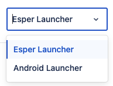

If you are unsure about the launcher for your use case, please contact Esper.

### Application

This setting will allow you to install applications during onboarding.

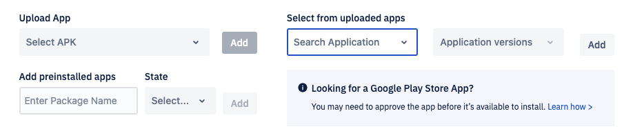

You can upload an APK, choose from the existing application and version, or add a preinstalled app. For a pre-installed application, you have the following options:

  

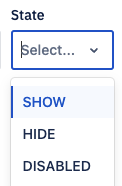

Show: will display the app on the home screen

Hide: will hide the app on the home screen.

Diable: will prevent the app from running in the background

  

Click Reset to Default for the default setting. Click Save and Continue to go to the next settings.

## Esper Setting App

### ​​Esper Settings App

This setting controls the user access to settings available via a hidden dock on the device. Esper Setting App has two modes:

1.  User Mode
    
2.  Admin Mode
    

Click Customize Setting to select different settings for the two modes.

  

-   About: Provides information regarding the endpoint name the device is enrolled in if the customer has access to multiple Esper endpoints.
    
-   Accessibility: Navigate to Android settings on Android 8.1 and lower devices, to change the accessibility settings.
    
-   Auto-Rotation: Turn auto-rotation On or Off. It has multiple states— Auto, Landscape, Portrait, Inverted Landscape, Inverted Portrait
    
-   Bluetooth: Navigate to the Android settings application on Android 8.1 and lower devices to change the Bluetooth setting. The scan button on the bottom right will allow searching and show nearby devices. Click the Connect button to pair the device, and the connection will happen immediately. You can connect only non-A2DP devices like headphones, mouse, and keyboards and can’t connect mobile phones and laptops.
    

Note: It is advised to pair and use only one device. In case another device is required, delete and unpair the old device before connecting the new one.

-   Clear App Data: Clears the data and cache for a particular application.
    
-   Display: Manage screen rotation, screen brightness, and screen timeout.
    
-   Factory Reset: Perform a factory reset of the device, regardless of the blueprint applied.
    
-   Esper Branding: Turn Off the Esper logo on the 'Home' screen.
    
-   Flashlight: Turn On the Torch (AKA “flashlight”) if the device has a camera flash LED.
    
-   Input Selection: Navigate to Android settings on Android 8.1 and lower devices to change the input selection for the device.
    
-   Keyboard: Navigate to Android settings on Android 8.1 and lower devices to change the keyboard settings.
    
-   Kiosk App Selection: Change the App that runs in kiosk mode. The device user can choose any app installed on the device to act as the kiosk app, with the Esper Console kept in sync on the configuration stats.
    
-   Language: Navigate to Android settings on Android 8.1 and lower devices to change the language setting.
    
-   Mobile Data: Access mobile data on the device.
    
-   Reboot: Ability to reboot the device.
    
-   Sound: Manage ringtone, alarm, device, and notification volume.
    
-   Storage: Helps grant permissions to any directories on the device. On devices running Android 10 or below, it is advised that the Console admins inform the users to grant permissions to the root folder. On Android 11 devices, permission cannot be granted to the root folders and download folder.
    
-   Time and Date: Navigate to Android settings on Android 8.1 and lower devices to change the date and time for the device.
    
-   Wi-Fi: Change the Wi-Fi access point used by the device. In Android 10 devices and above, it is recommended to enable GPS to view the network information on the device’s Wi-Fi screen. In the devices below Android 10, enabled GPS is needed to display scanned network information.
    

### App Accessible only via Hidden Dock

This toggle button helps you hide the Esper Settings App. The Esper Setting App can be accessed only by the hidden dock.

A hidden dock is available in both the kiosk mode and the multi-app mode. You can access it with 3-taps on the right corner in kiosk mode or 3-clicks on the power button in multi-app mode.

### Set Admin Pin

Admin Mode is password protected to prevent unauthorized access. This password controls access to the hidden dock available in kiosk mode, the Esper Settings app, and serves as the PIN used for IMEI-based onboarding via AfW. The password is alphanumeric and can have 1 to 10 characters.

The default password is 1234. It is possible to set up a template without a password for these features or just leave the default password; Esper strongly recommends setting up a more complex password for stronger security. The same password will be set for all devices provisioned using the Blueprint.

Note: A hidden doc is available in both the kiosk mode and the multi-app mode. You can access it with 3-taps on the right corner in kiosk mode or 3-clicks on the power button in multi-app mode.

### Android Setting App

This setting will display the icon for the default Android settings application on the device’s Home screen. Clicking this icon will take the user to the default Android settings. Depending on the other configurations set in the Blueprints, some options may be disabled to the user.

### Enable JSON

When ON, this setting lets you input a vaild JSON code.

Click Reset to Default for the default setting. Click Save and Continue to go to the next settings.

## Google Services

### Enroll Device In EMM

If you want device users to have access to your Managed Google Play Store, set the Google Play Store setting to On; if you don’t, set it to Off. You’ll still be able to install any approved Google Play Store applications from Esper if Play Store is turned Off. This only applies to GMS devices, as AOSP devices do not include Google Play Store support.

### Allow Personal Accounts

This setting enables you to restrict the number of Google accounts that can be added on the device and used with Google apps like Gmail, Google Play Store, and YouTube. By default, any number of accounts can be added to a specific device; this setting restricts this number. For example, if you set this setting to two, only two accounts will be permitted on the device, further addition (or deletion) of accounts will not be possible unless a different Blueprint is reapplied.

Notes:

1.  If you don’t check the Google account restrictions box and plan to provision your device in Multi-application mode, we recommend disabling Google Play Store to prevent the installation of unapproved applications.
    
2.  The Google Account Restriction feature is applicable only to Google Mobile Services (GMS) Android devices. If you include the Android Settings App and wish to prevent any Google accounts from being added, set the number of accounts to 0.
    

### Google Play Store Visibility

This setting will allow the Google Play Store on the device’s home screen. Toggle On to display Google Play Store if you don’t, set it to Off.

### Allow Device Access To Google Assistant

If you’d like device users to be able to use voice command via Google Assistant on supported devices, set Google Assistant to On; if you don’t, set it to Off.

Note: On some devices, this setting may need to be on if you wish to have Google Play Store show up on the device.

### Factory Reset Protection

Factory Reset Protection (FRP) places an auto-lock on a GMS-certified device if a user factory resets it with soft or hard keys. FRP will auto-lock the device and keep it locked until a pre-authorized Google account ID is entered. Additional information about getting your Google Account ID can be found [here](https://console-docs.esper.io/compliance-policy/frp.html).

When you turn On the FRP button in the blueprint, you’ll need to pick a Google account to authorize future device unlocks. Your chosen Google account ID will reverse any future auto-lock events triggered by user factory resets for all devices provisioned with this template.

Note: Factory reset protection is only available on GMS devices running Android 5.1 and above.

Click Reset to Default for the default setting. Click Save and Continue to go to the next settings.

## Device Security

### ADB Access

Android Debug Bridge (ADB) is a command-line tool that provides a Unix shell to communicate with an Android device. If the ADB Access option is checked in the device’s Blueprint, you may turn On ADB via Device > Settings for a configurable time period. If the ADB option is unchecked in the Blueprint, ADB cannot be turned On from the device settings. Opening the device ADB port is required on most stock Android devices before the Esper Agent can securely connect to the Esper Cloud for ADB debugging.

### Safe Mode Login

When Safe-Mode login is On, users will be able to boot to Safe Mode on the device; when Safe-Mode login is Off, users will be unable to boot to Safe Mode.

### Lock Screen

The lock screen enables the default lock screen to be displayed whenever a device screen times out, according to the timeout specified in the settings section. If this is On, the device user will have the option to set the password. The users must enter a password that follows the rules.

### Screen Timeout

The screen will timeout after the chosen time from the drop-down.

  

### Factory Reset

Factory Reset controls if users can perform a factory reset using the Android Settings App. When Factory Reset is off, the user will not be able to perform a factory reset on the device. This does not prevent a hard-key factory reset, see [Factory Reset Protection](https://console-docs.esper.io/provisioning-methods/factory-reset.html) to prevent hard-key factory reset.

  

### Lock Screen Password

The Lock Screen Password specifies the conditions for the device unlock password; the default is None.

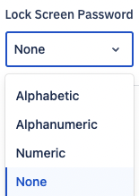

If you choose alphabetic or alphanumeric, you must set a password length of at least 4 characters and up to 25. Use the up/down arrows to set the required password length.

-   Alphabetic: Restricts acceptable passwords to only upper and lowercase alphabetic characters (A to Z, and a to z).
    
-   Alphanumeric: Expands acceptable passwords to include numbers, and special characters in addition to alphabetic characters.
    
-   Numeric: Restricts acceptable passwords to numbers only.
    

The user will set up the password for a device during the initial setup. The lock screen setting must be enabled in order to set the password type and character limit. If you select either Alphabetic or Alphanumeric password rules, then the lock screen will be set to On by Esper if it is currently Off.

  
:::tip
When the blueprint is applied with password type "None", but a password is already set by the user on the device, then the device will get priority. You can remove the password from the device remotely using our API. Contact [Esper team](https://support.esper.io/) for more information.
:::

Click Reset to Default for the default setting. Click Save and Continue to go to the next settings.

## Connectivity

### Allow Wi-Fi

If you would like the device user to use Wi-Fi on the device, set the Wi-Fi toggle button to On; if you don’t, set it to Off.

### Allow Bluetooth

If you would like the device user to use Bluetooth on the device, set the Bluetooth toggle button to On; if you don’t, set it to Off.

### Allow SMS

SMS controls sending and receiving of SMS, or text messages. If SMS is turned off, the device will not send or receive text messages from any application. Set SMS to On if you wish to enable sending and receiving of text messages.

### Allow NFC

If you want device users to use near-field communication (NFC) on their devices when supported, set NFC to On; if you don’t, set it to Off. If any of your applications require NFC, make sure this setting is On.

### Restrict Incoming calls

Selecting allow you to add the caller to block incoming calls.

Click Add/Edit Contacts to enter the caller details.

You can add phone numbers or upload a CSV file of contacts to add to the allowed list only.

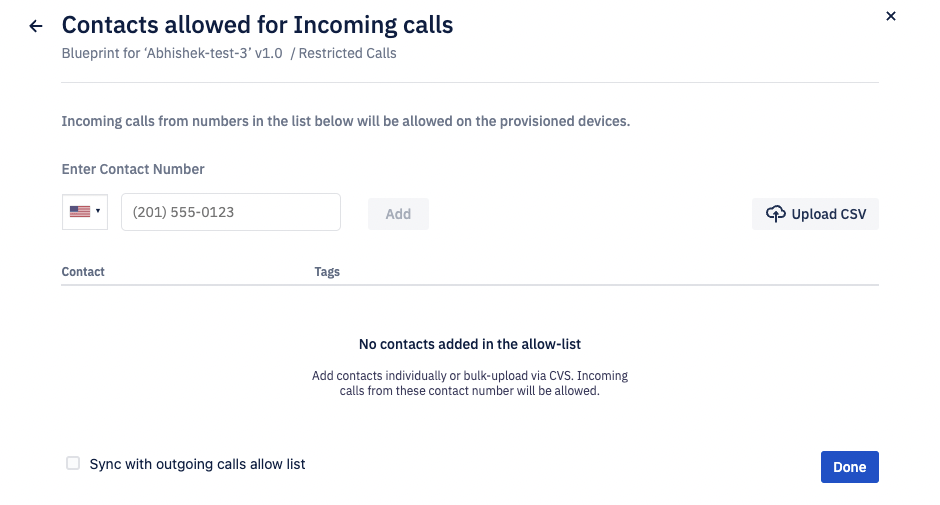

All numbers must be preceded by +country code (for example, +1 for the US). A comma must separate all numbers.

The following are some general guidelines for the CSV when uploading the CSV for Contacts.

1.  Download the template CSV file.
    
2.  Fill in the Contact's information according to the Header (e.g. Phone Number, Tag, Tag, Tag)  
    a. Please make sure that the Country Code is included in the Phone Number (e.g., +1)  
    b. Phone numbers should not include parentheses or hyphens (e.g. +18881234567)  
    c. Tag should not contain any Numeric or special characters (e.g., hyphens, quotes, etc.)
    
3.  Upload the filled out CSV (make sure the header is included in the file)  
    a. For Mac Users, you want want to alter the files End-Of-Line character to the Windows or Linux format.
    

### Restrict Outgoing calls

Selecting allow you to add the caller to block outgoing calls.

Adding/Editing Contacts is similar to the incoming calls.

  

### Wi-Fi Access Point

When you add a Wi-Fi access point to the Blueprint, you need to enter the details of the Wi-Fi access point. To add, click on Add Wi-Fi Access Point link.

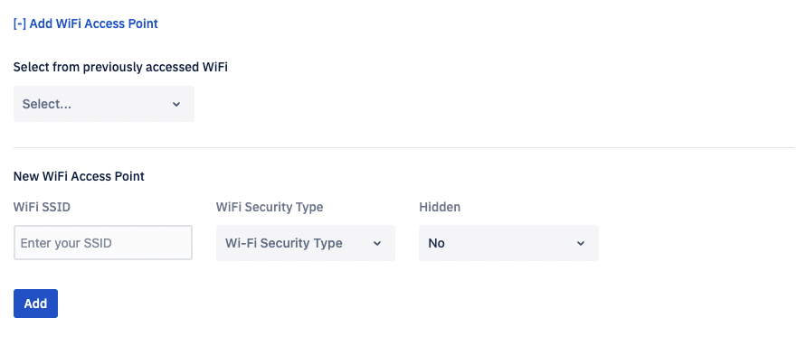

Enter the details and click Add.

  

Click Reset to Default for the default setting. Click Save and Continue to go to the next settings.

#### Wi-Fi Access Points

You can preload preferred Wi-Fi networks to which the provisioned device will automatically connect as they become available. The device will automatically connect to the given Wi-Fi access points as per the availability and network strength after onboarding.

The Wi-Fi on/off and WiFi access points features are not available for devices running Android 10.0 and above.

When you are adding a new access point, you have four fields to configure: Wi-Fi SSID, Wi-Fi Password, Wi-Fi Security type, Hidden. The Wi-Fi SSID and Wi-Fi Password fields are text fields for the SSID and password. Select the security type from the dropdown menu. There are four possible choices:

-   NONE
    
-   WPA- Wireless Protected Access
    
-   WEP- Wired Equivalent Privacy
    
-   EAP- Extensible Authentication Protocol
    

None: None is a open type network. Requirement: SSID

WEP: WEP is a open type network with password. Requirements: SSID, Password (limit: 13 characters)

WPA :Android refers to WPA as WPA/WPA2 but technically WPA and WPA2 are little different from each other. WPA is an enhanced version of WEP. ß Requirements: SSID,Password (limit: 63 characters) EAP: Internally EAP is known as WPA/WPA2/WPA3-Enterprise.

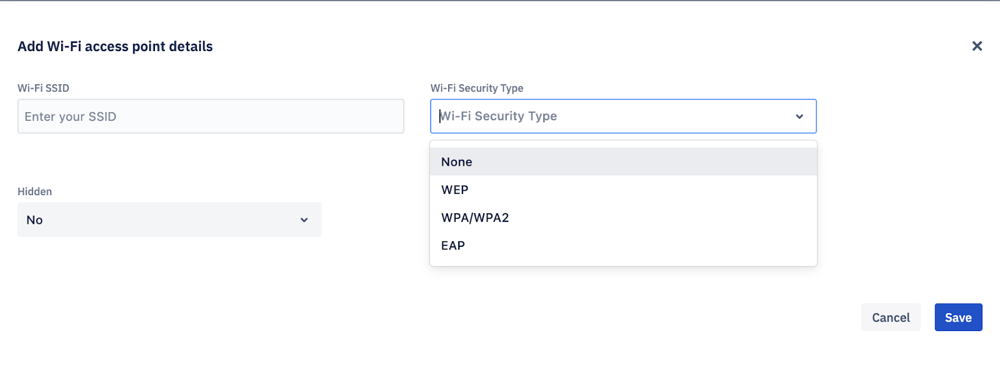

If you select EAP, you will be prompted to enter additional information.

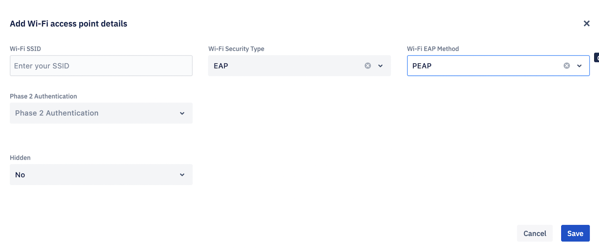

Wi-Fi EAP Method is a drop-down with the following options:

-   PEAP-  
    Phase 2 Authentication  
    Identity (Optional)  
    Anonymous Identity (Optional)  
    Password
    
-   TLS-  
    Identity (Optional)
    
-   TTLS-  
    Identity (Optional)  
    Anonymous Identity (Optional)
    

Password

-   PWD-  
    Identity (Optional)  
    Password (Optional)
    

Similarly, the Phase 2 Authentication is also a dropdown with the following options:

-   NONE
    
-   PAP  
    Identity (Optional)  
    Anonymous Identity (Optional)  
    Password
    
-   MSCHAP  
    Identity (Optional)  
    Anonymous Identity (Optional)  
    Password
    
-   MSCHAPV2  
    Anonymous Identity (Optional)  
    Password
    
-   GTC Do not valid  
    Identity (Optional)  
    Anonymous Identity (Optional)  
    Password
    
-   SIM
    
-   AKA
    
-   AKA_PRIME
    

In Android 10 and above, when a WiFi access point is added directly from the device, it is recommended that GPS is ON so that WiFi access point can reflect back on the Console.

## Display & Branding

### Brightness

Use the Brightness slider to increase or decrease the brightness of the screen.

### Screen Orientation

Select screen orientation from the options: Auto, Landscape, and Portrait. Some device makers swap the settings for Landscape and Portrait. If your device was provisioned with a specific orientation but is locked into the other orientation, try swapping this setting to achieve the proper screen orientation.

### ScreenShot

This setting will allow or restrict the device user from taking a screenshot.

### Notification Bar

This setting will enable/disable the notification bar on the device.

### Home Screen Wallpaper

You can upload wallpaper files in either the portrait or the landscape mode. Click upload and browse a file up to 5MB in size.

### Lock Screen Wallpaper

You can upload a lock screen image or use the same image for the home screen and lock screen.

  

Click Save and Continue to move to the next setting or choose a different setting from the drop-down.

## Sound

This section lets you adjust the sound settings of the devices in the group. Use the sliders to adjust the Alarm volume, Notification volume, Music volume, and Ring volume.

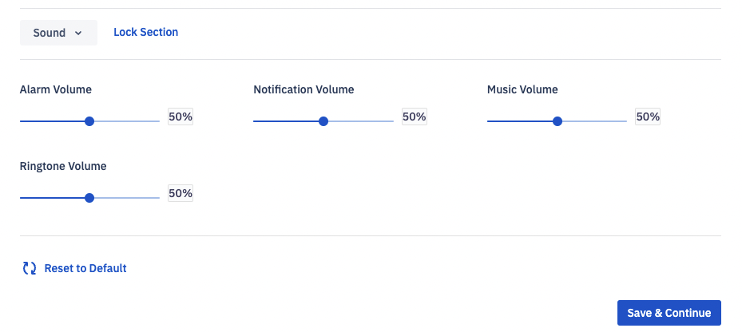

Click Reset to Default for the default setting. Click Save and Continue to go to the next settings.

## Time & Date

### Edit Time & Date

Using the toggle button, enable/disable the device user’s ability to edit the time and date.

### Time Zone

Select the time zone in which the device will be deployed. After deployment, you will have the ability to change the device’s time zone remotely via the Blueprint.

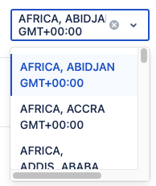

Note: If you don’t specify a device time zone, the time zone set by the device will be used.

The Time Zone field has a robust search capability. As you begin to type, suggestions will be displayed. For example, typing "Pacific" will bring up all the time zones that start with "Pacific." Listings are by country, for example, to find the timezones for the U.S.A., search for "America" or "US".

### Language

You can set the language for the device under the ‘Language’ setting while creating or editing a Blueprint.

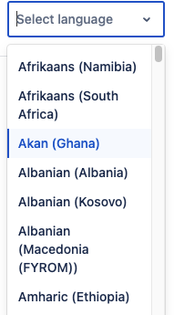

Click Reset to Default for the default setting. Click Save and Continue to go to the next settings.

  

## System Updates

### System Updates

This drop-down lets you choose your preference for updates.

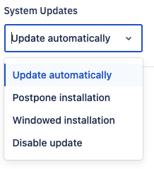

Update automatically: This setting will update all the devices as soon as an update is available.

Postpone installation: This setting will delay the installation of a system update by 30 days.

Windowed installation: This setting llows you to specify a window in which system updates can occur.

Disable updates: This setting will disable system updates. If this setting is not supported by the device the updated policy will default to Postpone Installation.

Click Reset to Default for the default setting. Click Save and Continue to go to the next settings.

## Hardware Settings

### External Device

This setting allows you to connect external devices. If you want device users to be able to connect other hardware to the device, set the External Device toggle button to On. If you don’t, set it Off.

### USB Tethering

USB tethering allows users to connect USB devices, such as flash drive, digital camera, mouse, or keyboard to the device. If you want device users to be able to connect other hardware to the device, set USB Connectivity to On. If you don’t, set it Off.

### File Transfer

If you’d like device users to be able to transfer files from the device using a USB cable or flash drive, set USB file transfer to On; if you don’t, set it to Off.

### Camera

If you want device users to be able to use the camera, set Camera Access to On. If you don’t, set it Off.

Note: Your application can still access the camera if this setting is off.

### Location

Click Reset to Default for the default setting. Click Save and Continue to go to the next settings.

## Files

You can upload and push files to all the devices onboarded using this Blueprint. Click Add file to upload a new file. You can edit and remove an already uploaded file. To clear the entire file list click Clear File List.

  
  

